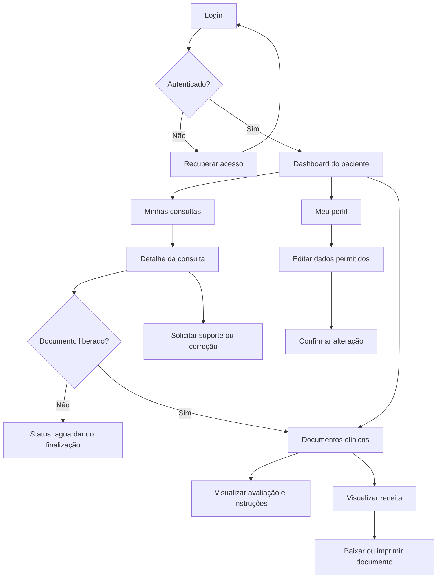
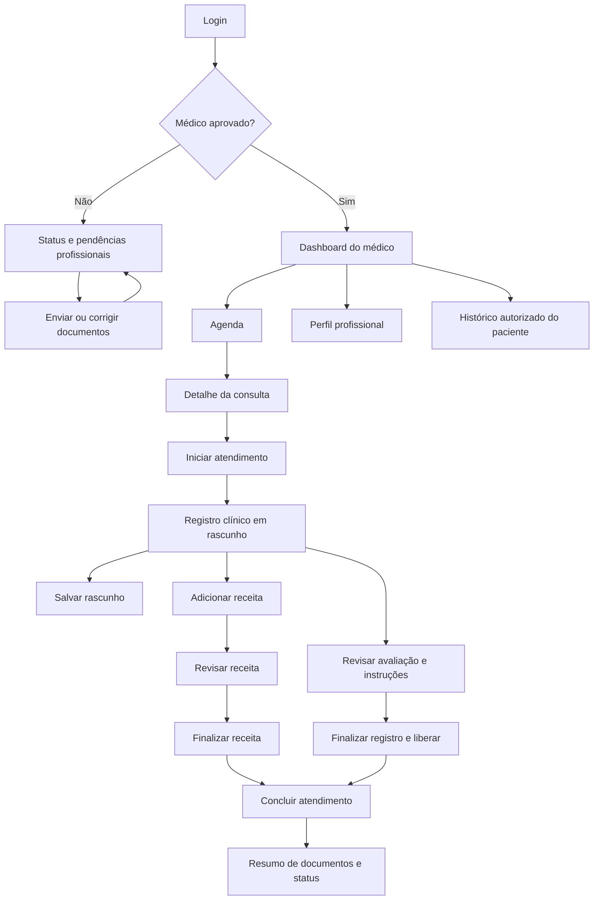

# PRD — Aplicativo de Consultas Médicas

**Versão:** 1.0  
**Data:** 17 de setembro de 2026  
**Autor:** Manus AI  
**Status:** Documento de requisitos para definição e desenvolvimento do MVP

## 1. Visão geral

O aplicativo de consultas médicas centraliza o cadastro de usuários, a aprovação de médicos, o gerenciamento de consultas e o registro das orientações clínicas fornecidas após cada atendimento. O sistema terá quatro perfis principais: **Administrador**, **Secretário**, **Médico** e **Paciente**.

O produto deve proteger os dados pessoais e clínicos dos usuários por meio de autenticação, autorização por perfil, registro de alterações e controle rigoroso de acesso. O paciente deverá consultar somente os próprios dados, consultas, instruções e receitas. O médico deverá acessar apenas os pacientes e consultas que estejam sob sua responsabilidade. O secretário deverá organizar a agenda, sem necessariamente ter acesso ao conteúdo clínico das receitas e avaliações.

## 2. Objetivos do produto

O produto deverá:

1. Permitir o cadastro e a atualização dos dados pessoais dos usuários.
2. Permitir que administradores gerenciem contas e aprovem ou rejeitem cadastros de médicos.
3. Permitir que secretários criem, alterem, confirmem e cancelem consultas.
4. Permitir que médicos visualizem sua agenda e os dados necessários dos pacientes atendidos.
5. Permitir que médicos registrem, após a consulta, uma avaliação clínica, instruções e receita médica.
6. Permitir que pacientes visualizem suas próprias consultas e os documentos clínicos liberados pelo médico.
7. Manter histórico e rastreabilidade das operações sensíveis.

## 3. Escopo do MVP

### 3.1 Incluído

O MVP incluirá autenticação, recuperação de acesso, controle de permissões por perfil, cadastro e edição de perfil, fluxo de aprovação de médicos, agenda de consultas, status de atendimento, registro clínico pós-consulta e visualização de receitas e instruções pelo paciente.

O sistema deverá oferecer uma interface web responsiva, adequada para computadores, tablets e celulares. O idioma inicial será o português do Brasil.

### 3.2 Fora do escopo inicial

Os itens abaixo poderão ser planejados para versões futuras:

- Teleconsulta por vídeo.
- Integração com convênios, operadoras e sistemas hospitalares.
- Integração com farmácias ou envio automático de receita a terceiros.
- Pagamentos e emissão de notas fiscais.
- Prescrição digital com assinatura certificada.
- Aplicativos nativos para Android e iOS.
- Lembretes por SMS ou WhatsApp.
- Inteligência artificial para diagnóstico ou recomendação clínica.

## 4. Perfis de usuário e permissões

| Perfil | Objetivo | Permissões principais |
|---|---|---|
| **Administrador** | Administrar a plataforma e as contas | Gerenciar usuários, ativar ou desativar contas, aprovar ou rejeitar médicos, consultar logs e configurar parâmetros básicos |
| **Secretário** | Operar a agenda | Cadastrar e gerenciar consultas, consultar disponibilidade, confirmar ou cancelar horários e visualizar informações administrativas necessárias |
| **Médico** | Realizar atendimentos e registrar orientações | Gerenciar o próprio perfil, visualizar sua agenda, consultar dados dos pacientes vinculados às consultas e criar registros clínicos e receitas |
| **Paciente** | Acompanhar seus atendimentos | Gerenciar o próprio perfil, visualizar suas consultas e acessar suas instruções e receitas disponibilizadas |

### 4.1 Regras de autorização

O sistema deverá aplicar autorização no servidor, e não somente ocultar opções na interface. Cada requisição deverá ser validada conforme o usuário autenticado, o perfil e o vínculo com o recurso solicitado.

Um médico não poderá visualizar consultas de outro médico. Um paciente não poderá acessar dados, consultas ou receitas de outro paciente. O secretário deverá acessar apenas os campos necessários para a gestão da agenda, salvo autorização explícita definida pelo administrador. O administrador poderá gerenciar contas, mas o acesso ao conteúdo clínico deverá ser limitado ao necessário para suporte e auditoria, conforme a política institucional de privacidade.

## 5. Requisitos funcionais

### RF-01 — Autenticação e acesso

O sistema deverá permitir login por e-mail ou identificador configurado pela instituição, com senha armazenada de forma segura. Deverá existir fluxo de recuperação de senha e encerramento de sessão.

O sistema deverá bloquear ou exigir redefinição de senha após sucessivas tentativas inválidas, conforme parâmetro configurável. Todas as sessões deverão expirar após período de inatividade definido pela administração.

### RF-02 — Cadastro de usuários

O sistema deverá permitir o cadastro de pacientes e a criação de contas administrativas, de secretaria e médicas conforme o fluxo definido pela instituição.

O cadastro deverá conter, no mínimo:

- Nome completo.
- CPF.
- Data de nascimento.
- E-mail.
- Número de contato.
- Endereço completo.
- Senha ou convite para criação de senha.
- Status da conta.
- Perfil de acesso.

Para médicos, o cadastro deverá conter também os dados profissionais definidos pela instituição, como número do registro profissional, estado do registro, especialidade e documentos comprobatórios, quando aplicável.

O CPF deverá ser validado quanto ao formato e à unicidade. O sistema não deverá exibir o CPF completo para usuários que não tenham necessidade operacional de acessá-lo.

### RF-03 — Edição de perfil

Todo usuário deverá poder alterar os próprios dados permitidos, incluindo endereço, telefone, e-mail e senha. Alterações em campos sensíveis, como CPF, perfil, status da conta e registro profissional, deverão seguir regras específicas e, quando necessário, exigir validação do administrador.

O sistema deverá registrar data, usuário e campos alterados. Quando o e-mail for alterado, poderá ser exigida confirmação do novo endereço antes da ativação.

### RF-04 — Administração de contas

O administrador deverá visualizar uma lista de usuários com filtros por nome, CPF, perfil, status e data de cadastro. Deverá poder ativar, desativar, bloquear, desbloquear e redefinir o acesso de contas, respeitando o registro de auditoria.

A desativação de uma conta não deverá apagar o histórico de consultas, receitas ou registros clínicos associados. O sistema deverá impedir a exclusão física de dados clínicos por operação comum da interface.

### RF-05 — Aprovação de médicos

O cadastro de um médico deverá iniciar com status **Pendente de aprovação**. O médico não poderá acessar funcionalidades de atendimento enquanto não for aprovado.

O administrador deverá poder:

- Consultar os dados cadastrais e documentos enviados.
- Aprovar o cadastro.
- Rejeitar o cadastro informando um motivo.
- Solicitar correção ou complementação de informações.
- Suspender posteriormente a habilitação do médico.

O sistema deverá manter o histórico de decisões, incluindo responsável, data, decisão e justificativa. O médico deverá visualizar o status da aprovação e a justificativa quando houver rejeição ou pendência.

### RF-06 — Cadastro de consultas

O secretário deverá criar consultas informando, no mínimo:

- Paciente.
- Médico.
- Data.
- Horário de início.
- Duração prevista.
- Tipo ou motivo administrativo da consulta, se aplicável.
- Observações administrativas.
- Status.

O sistema deverá impedir conflito de horários para o mesmo médico. Também deverá permitir reagendamento, confirmação, cancelamento e marcação de ausência, com registro do motivo quando aplicável.

Os status mínimos serão:

1. **Agendada**.
2. **Confirmada**.
3. **Em atendimento**.
4. **Concluída**.
5. **Cancelada**.
6. **Paciente ausente**.
7. **Médico ausente**.

O sistema deverá preservar o histórico de alterações da consulta, incluindo o usuário responsável e os horários anteriores.

### RF-07 — Agenda do médico

O médico deverá visualizar sua agenda em formato de lista e calendário, com filtros por dia, semana, mês e status. Cada item deverá exibir o nome do paciente, data, horário, status e informações administrativas necessárias.

O médico não deverá acessar a agenda de outros médicos, exceto por uma permissão administrativa explicitamente configurada.

### RF-08 — Atendimento e registro pós-consulta

Após o atendimento, o médico deverá poder registrar um documento clínico associado à consulta. O registro deverá conter, conforme o modelo definido pela instituição:

- Data e identificação do atendimento.
- Queixa ou motivo do atendimento.
- Avaliação clínica.
- Orientações ao paciente.
- Condutas recomendadas.
- Medicamentos, quando aplicável.
- Exames ou acompanhamentos recomendados.
- Observações adicionais.
- Identificação do médico responsável.

O registro deverá possuir estados **Rascunho**, **Finalizado** e, se necessário, **Corrigido por adendo**. Após finalizado, o conteúdo original não deverá ser apagado ou alterado silenciosamente. Correções deverão gerar uma nova versão ou adendo, preservando o histórico.

O registro clínico somente deverá ser disponibilizado ao paciente após a finalização pelo médico.

### RF-09 — Receita médica

O médico deverá poder criar uma receita associada ao atendimento. A receita deverá permitir informar medicamento, apresentação, concentração, dose, frequência, duração, quantidade e instruções de uso, além de observações relevantes.

A receita deverá conter identificação do paciente, identificação do médico, data de emissão e número ou identificador único do documento. A interface deverá apresentar claramente que a receita é um documento emitido pelo profissional responsável e que o sistema não substitui requisitos legais de assinatura ou certificação quando estes forem necessários.

O MVP poderá disponibilizar a receita para visualização e impressão em formato PDF. A emissão de receita digital com validade regulatória dependerá de requisitos legais, certificação e integração específicos, que não fazem parte deste escopo inicial.

### RF-10 — Área do paciente

O paciente deverá visualizar somente suas próprias consultas, com data, horário, médico, status e informações administrativas disponíveis.

Após a finalização e liberação pelo médico, o paciente deverá acessar suas orientações, avaliações e receitas. O paciente deverá poder visualizar, imprimir ou baixar os documentos permitidos pela política da instituição.

O paciente não deverá editar registros clínicos ou receitas. Caso identifique uma inconsistência, deverá existir uma opção de solicitar correção ou entrar em contato com a secretaria, sem modificar o documento original.

### RF-11 — Notificações

O sistema deverá exibir notificações internas para eventos relevantes, como aprovação ou rejeição de médico, agendamento, reagendamento, cancelamento e disponibilização de documento clínico.

O envio de e-mail poderá fazer parte do MVP, desde que configurado. Mensagens não deverão incluir informações clínicas sensíveis no conteúdo do e-mail; deverão direcionar o usuário para o sistema autenticado.

### RF-12 — Auditoria

O sistema deverá registrar ações relevantes, incluindo login, falhas de login, alterações de perfil, mudanças de permissão, aprovação de médicos, criação e alteração de consultas, acesso a documentos clínicos, finalização de registros e emissão ou correção de receitas.

Cada evento deverá conter, no mínimo, usuário, perfil, data e hora, ação, recurso afetado e resultado. O acesso aos logs deverá ser restrito a administradores autorizados.

## 6. Fluxos principais

### 6.1 Aprovação de médico

1. O médico envia seus dados e documentos.
2. O sistema cria a conta com status pendente.
3. O administrador recebe uma notificação de pendência.
4. O administrador analisa as informações.
5. O administrador aprova, rejeita ou solicita complementação.
6. O sistema registra a decisão e notifica o médico.
7. Após aprovação, o médico pode acessar a agenda e realizar registros.

### 6.2 Agendamento de consulta

1. O secretário seleciona paciente, médico, data e horário.
2. O sistema verifica disponibilidade e conflitos.
3. O secretário confirma o agendamento.
4. O sistema cria a consulta com status agendada.
5. O paciente e o médico visualizam a consulta conforme suas permissões.
6. A secretaria poderá confirmar, reagendar ou cancelar o compromisso.

### 6.3 Atendimento e receita

1. O médico abre uma consulta confirmada ou em atendimento.
2. O sistema exibe os dados necessários do paciente.
3. O médico registra a avaliação e as instruções.
4. O médico preenche a receita, se necessária.
5. O médico salva como rascunho ou finaliza.
6. Ao finalizar, o sistema bloqueia alterações silenciosas e gera uma versão do documento.
7. O paciente passa a visualizar os documentos liberados.

## 7. Regras de negócio

| ID | Regra |
|---|---|
| RN-01 | Uma conta deve possuir um único perfil principal de acesso, salvo configuração explícita de múltiplos papéis pela instituição. |
| RN-02 | Um médico pendente, rejeitado ou suspenso não pode atender nem emitir registros clínicos no sistema. |
| RN-03 | CPF e e-mail devem ser únicos quando usados como identificadores da conta. |
| RN-04 | Uma consulta não pode ocupar o mesmo horário de outra consulta do mesmo médico. |
| RN-05 | Somente o médico vinculado à consulta pode finalizar o registro clínico, salvo fluxo administrativo de correção controlada. |
| RN-06 | O paciente só pode visualizar documentos finalizados e liberados. |
| RN-07 | Cancelar uma consulta não deve apagar seus dados nem os registros de auditoria. |
| RN-08 | Registros clínicos e receitas finalizados não podem ser excluídos pela interface comum. |
| RN-09 | Toda alteração sensível deve ser auditável. |
| RN-10 | O sistema deve aplicar o princípio do menor privilégio para todos os perfis. |

## 8. Requisitos não funcionais

### RNF-01 — Segurança

As senhas deverão ser armazenadas com algoritmo de hash adequado. O sistema deverá utilizar comunicação criptografada, proteção contra sessões inválidas, controle de acesso no servidor, validação de entrada e proteção contra ataques comuns de aplicação web.

### RNF-02 — Privacidade e proteção de dados

O produto deverá ser desenvolvido considerando a legislação aplicável à proteção de dados pessoais e às informações de saúde no Brasil. A instituição deverá definir base legal, política de retenção, responsáveis pelo tratamento, procedimento para atendimento a solicitações de titulares e regras de compartilhamento.

O sistema deverá coletar somente dados necessários, limitar o acesso por função e manter registros de acesso a informações sensíveis. O texto legal definitivo deverá ser revisado pela equipe jurídica ou de privacidade da instituição.

### RNF-03 — Disponibilidade e recuperação

O sistema deverá possuir rotina de backup, restauração testada e monitoramento de erros. Os objetivos de disponibilidade, tempo máximo aceitável de indisponibilidade e perda máxima de dados deverão ser definidos antes da entrada em produção.

### RNF-04 — Desempenho

As telas principais deverão responder em tempo adequado em condições normais de uso. Listas de usuários, consultas e auditoria deverão utilizar paginação e filtros no servidor para evitar carregamento excessivo.

### RNF-05 — Acessibilidade e usabilidade

A interface deverá utilizar linguagem clara, contraste adequado, navegação por teclado, mensagens de erro compreensíveis e formulários com rótulos associados aos campos. O fluxo de agendamento deverá reduzir a possibilidade de selecionar horários indisponíveis.

### RNF-06 — Rastreabilidade

O sistema deverá permitir identificar quem criou, visualizou, alterou, finalizou ou cancelou cada recurso sensível, respeitando as permissões de consulta dos logs.

## 9. Modelo de dados conceitual

As entidades mínimas do sistema serão:

- **Usuário:** identificação, credenciais, perfil, status e datas de criação e atualização.
- **Perfil pessoal:** nome completo, CPF, data de nascimento, telefone e endereço.
- **Perfil profissional:** número de registro, estado, especialidade, documentos e status de aprovação.
- **Consulta:** paciente, médico, data, horário, duração, status e observações administrativas.
- **Registro clínico:** consulta, avaliação, orientações, condutas, versão, status e autor.
- **Receita:** consulta, paciente, médico, itens prescritos, data, versão, status e identificador do documento.
- **Notificação:** destinatário, tipo, mensagem, data de leitura e recurso relacionado.
- **Auditoria:** usuário, ação, recurso, data, resultado e metadados técnicos.

## 10. Telas previstas para o MVP

1. Login e recuperação de senha.
2. Primeiro acesso e criação de senha.
3. Dashboard do administrador.
4. Lista e detalhe de usuários.
5. Fila de aprovação de médicos.
6. Perfil do usuário.
7. Dashboard da secretaria.
8. Calendário e formulário de consulta.
9. Agenda do médico.
10. Tela de atendimento e registro clínico.
11. Editor de receita.
12. Área do paciente.
13. Visualizador e impressão de receita.
14. Central de notificações.
15. Consulta de auditoria, com acesso restrito.

## 11. Critérios de aceite do MVP

O MVP será considerado funcional quando:

- Um administrador conseguir criar, ativar, desativar e administrar contas sem apagar o histórico associado.
- Um médico conseguir enviar ou completar seus dados e permanecer bloqueado até a aprovação do administrador.
- Um administrador conseguir aprovar, rejeitar ou solicitar correções no cadastro médico, com justificativa e histórico.
- Um secretário conseguir agendar, alterar, confirmar e cancelar consultas sem criar conflitos de agenda.
- Um médico aprovado conseguir visualizar somente sua agenda e os pacientes vinculados às suas consultas.
- Um médico conseguir finalizar uma avaliação e uma receita associadas a uma consulta concluída.
- Um paciente conseguir visualizar somente suas consultas e os documentos finalizados que lhe foram liberados.
- Alterações em registros finalizados preservarem a versão anterior e gerarem auditoria.
- Usuários não autorizados receberem resposta de acesso negado ao tentar consultar recursos de outro perfil ou de outro paciente.
- Os principais eventos de segurança, conta, agenda e documentos clínicos aparecerem nos logs de auditoria.

## 12. Indicadores de sucesso

Os indicadores iniciais recomendados são:

- Percentual de cadastros médicos analisados dentro do prazo operacional definido.
- Percentual de consultas sem conflito de agenda.
- Tempo médio para agendar ou reagendar uma consulta.
- Percentual de atendimentos com registro clínico finalizado.
- Percentual de pacientes que conseguem acessar uma receita liberada sem suporte manual.
- Quantidade de incidentes de acesso indevido ou falhas de autorização.
- Taxa de erro em emissão, visualização e impressão de documentos.

## 13. Riscos e decisões pendentes

Antes do desenvolvimento, a instituição deverá decidir se o secretário poderá visualizar o motivo clínico da consulta e quais campos serão considerados administrativos. Também deverá definir se haverá múltiplas unidades, múltiplas especialidades, mais de um médico por consulta e se o paciente poderá possuir dependentes ou responsáveis legais.

É necessário definir o procedimento para correção de receitas e registros clínicos, bem como os requisitos de assinatura, validade e certificação de receitas no contexto operacional da instituição. A política de retenção e eliminação de dados deverá ser aprovada antes da implementação de rotinas de arquivamento.

Também deverão ser definidos os canais de notificação, os horários de atendimento da secretaria, os fusos horários usados pelo sistema e o nível de acesso do administrador aos dados clínicos.

## 14. Priorização sugerida

### Prioridade alta

Autenticação, perfis e permissões; cadastro e edição de perfil; aprovação de médicos; agenda da secretaria; agenda do médico; área do paciente; registro clínico; receita; auditoria básica e proteção de dados.

### Prioridade média

Notificações por e-mail; filtros avançados; exportação de agenda; relatórios operacionais; adendos clínicos; suporte a múltiplas unidades.

### Prioridade futura

Teleconsulta; integração com assinatura digital; integração com convênios e farmácias; pagamentos; aplicativos nativos; notificações por WhatsApp e SMS.

# 15. Histórias de usuário e critérios de aceite

Os critérios abaixo seguem formato orientado a comportamento. Cada história deve ser implementada com testes de unidade, integração e autorização sempre que houver acesso a dados pessoais ou clínicos.

## 15.1 Fluxo do paciente

### PAT-01 — Criar conta e completar perfil

**Como paciente**, quero criar minha conta e informar meus dados pessoais, para poder utilizar o serviço de consultas.

**Critérios de aceite**

- Dado que o e-mail e o CPF ainda não estejam cadastrados, quando o paciente enviar nome completo, CPF, data de nascimento, e-mail, telefone, endereço e senha válida, então o sistema deverá criar a conta com perfil `PACIENTE`.
- O sistema deverá validar campos obrigatórios, formato de e-mail, formato de CPF e política de senha antes de persistir o cadastro.
- Se o CPF ou e-mail já existir, o cadastro deverá ser rejeitado sem revelar dados da conta existente além da mensagem operacional necessária.
- O sistema deverá registrar data de criação, origem do cadastro e versão dos termos apresentados.
- A senha não deverá ser armazenada em texto simples.

### PAT-02 — Acessar e atualizar dados pessoais

**Como paciente**, quero visualizar e alterar meu perfil, para manter meus dados de contato atualizados.

**Critérios de aceite**

- O paciente deverá visualizar somente o próprio perfil.
- O paciente poderá alterar nome de exibição, telefone, e-mail e endereço, conforme a política da instituição.
- Alterações de e-mail deverão exigir confirmação do novo endereço antes de serem usadas para recuperação de conta.
- CPF, histórico clínico, receitas e permissões não poderão ser alterados pelo paciente.
- Cada alteração deverá registrar usuário, data, campos alterados e resultado.
- Se a atualização falhar, os dados anteriores deverão permanecer íntegros e o usuário deverá receber uma mensagem compreensível.

### PAT-03 — Autenticar e recuperar acesso

**Como paciente**, quero entrar com segurança e recuperar minha senha, para acessar meus dados sem depender da secretaria.

**Critérios de aceite**

- Credenciais válidas deverão criar uma sessão associada ao paciente correto.
- Credenciais inválidas deverão retornar mensagem genérica, sem indicar se o e-mail existe.
- O fluxo de recuperação deverá usar token de uso único, com validade limitada e sem expor a senha anterior.
- O token deverá ser invalidado após uso, expiração ou solicitação de um novo token.
- O sistema deverá registrar tentativas de login, recuperação e encerramento de sessão.

### PAT-04 — Consultar minhas consultas

**Como paciente**, quero visualizar minhas consultas, para saber data, horário, médico e situação do atendimento.

**Critérios de aceite**

- A lista deverá exibir somente consultas cujo `patient_id` corresponda ao paciente autenticado.
- Cada consulta deverá exibir médico, data, hora, duração, status e instruções administrativas disponíveis.
- Consultas deverão poder ser filtradas por período e status.
- Consulta cancelada deverá permanecer visível no histórico, identificada como cancelada.
- Uma tentativa de acessar o identificador de consulta de outro paciente deverá retornar `403` ou resposta equivalente sem revelar o recurso.

### PAT-05 — Visualizar detalhes da consulta

**Como paciente**, quero abrir os detalhes de uma consulta, para revisar as informações do atendimento agendado.

**Critérios de aceite**

- O paciente deverá visualizar o detalhe somente quando for o titular da consulta ou estiver autorizado como responsável legal.
- Antes do atendimento, o detalhe não deverá expor anotações privadas do médico ou campos internos da secretaria.
- O sistema deverá mostrar o status mais recente e a data da última atualização.
- A consulta deverá indicar se existe documento clínico disponível.

### PAT-06 — Acessar avaliação e instruções liberadas

**Como paciente**, quero ler a avaliação e as instruções do médico, para entender como conduzir meu cuidado após o atendimento.

**Critérios de aceite**

- Somente registro clínico com status `FINALIZADO` e `released_at` preenchido poderá ser exibido.
- O paciente deverá visualizar o conteúdo em modo somente leitura.
- O sistema deverá mostrar médico responsável, data do atendimento, data de finalização e versão do documento.
- Um rascunho ou registro arquivado não deverá aparecer na área do paciente.
- O acesso deverá gerar evento de auditoria sem registrar o conteúdo clínico em logs de aplicação.

### PAT-07 — Visualizar, baixar e imprimir receita

**Como paciente**, quero visualizar ou imprimir minha receita, para seguir as orientações do médico.

**Critérios de aceite**

- A receita deverá estar vinculada à consulta e ao paciente autenticado.
- O documento deverá apresentar paciente, médico, data de emissão, itens prescritos, instruções e identificador da receita.
- O download deverá gerar arquivo com controle de acesso temporário ou streaming autenticado; o arquivo não deverá ficar público por URL previsível.
- Receita em rascunho, cancelada ou substituída deverá ser identificada conforme seu status e não deverá ser apresentada como vigente.
- A interface deverá informar que validade jurídica, assinatura e certificação dependem do processo regulatório adotado pela instituição.

### PAT-08 — Solicitar correção ou suporte

**Como paciente**, quero solicitar correção de uma informação, para comunicar uma possível inconsistência sem editar o prontuário.

**Critérios de aceite**

- O paciente deverá poder abrir uma solicitação vinculada à consulta ou documento.
- A solicitação deverá conter categoria, descrição, data e status.
- O paciente não poderá alterar o documento clínico diretamente.
- A equipe autorizada deverá visualizar a solicitação sem que o paciente passe a ver dados de outros usuários.
- O sistema deverá preservar o documento original e registrar qualquer adendo ou correção formal.

## 15.2 Fluxo do médico

### DOC-01 — Completar cadastro profissional

**Como médico**, quero informar meus dados profissionais, para solicitar habilitação de atendimento.

**Critérios de aceite**

- O médico deverá informar registro profissional, estado do registro, especialidade e documentos solicitados pela instituição.
- O sistema deverá criar o perfil com status `PENDING_APPROVAL`.
- Enquanto estiver pendente, o médico poderá corrigir dados cadastrais permitidos, mas não poderá acessar pacientes, abrir consultas clínicas ou emitir receitas.
- O sistema deverá registrar versões dos documentos enviados e o hash dos arquivos quando aplicável.

### DOC-02 — Consultar status de aprovação

**Como médico**, quero acompanhar a análise do meu cadastro, para saber quando estarei habilitado.

**Critérios de aceite**

- O médico deverá visualizar status `PENDING_APPROVAL`, `APPROVED`, `REJECTED` ou `SUSPENDED`.
- Em caso de rejeição ou solicitação de correção, o sistema deverá exibir o motivo definido pelo administrador.
- A aprovação deverá registrar responsável, data, justificativa e versão dos dados analisados.
- Somente status `APPROVED` deverá habilitar funcionalidades clínicas.

### DOC-03 — Visualizar minha agenda

**Como médico**, quero visualizar minhas consultas, para organizar meus atendimentos.

**Critérios de aceite**

- A agenda deverá retornar apenas consultas cujo `doctor_id` corresponda ao médico autenticado.
- O médico deverá poder filtrar por dia, semana, mês, status e nome do paciente.
- Cada item deverá apresentar nome do paciente, data, horário, duração e status.
- O médico não deverá visualizar observações administrativas que a instituição classifique como restritas, nem dados de consultas de outros médicos.
- Horários deverão ser exibidos no fuso horário configurado para a unidade de atendimento.

### DOC-04 — Abrir atendimento

**Como médico**, quero iniciar um atendimento agendado, para registrar o que ocorreu na consulta.

**Critérios de aceite**

- O médico deverá abrir somente consulta vinculada a ele e em estado compatível com atendimento.
- Ao iniciar, o sistema poderá alterar o status para `IN_PROGRESS`, registrando data e usuário responsável.
- A tela deverá exibir apenas os dados clínicos e cadastrais necessários à assistência.
- O sistema deverá impedir que o médico acesse prontuário de paciente sem consulta ou vínculo autorizado.
- O sistema deverá permitir salvar rascunho sem disponibilizá-lo ao paciente.

### DOC-05 — Registrar avaliação e instruções

**Como médico**, quero registrar avaliação, conduta e instruções, para documentar o atendimento e orientar o paciente.

**Critérios de aceite**

- O médico deverá preencher os campos obrigatórios definidos pela instituição antes da finalização.
- O registro deverá estar vinculado a uma única consulta, paciente e médico.
- O médico poderá salvar como `DRAFT` e continuar posteriormente.
- Ao selecionar `FINALIZE`, o sistema deverá validar os campos, gerar versão imutável e registrar `finalized_at`.
- O paciente não deverá visualizar o conteúdo antes da finalização e liberação.
- Falha de persistência não poderá apresentar mensagem de sucesso nem perder silenciosamente o texto salvo.

### DOC-06 — Emitir receita

**Como médico**, quero registrar uma receita associada ao atendimento, para fornecer instruções de medicamentos ao paciente.

**Critérios de aceite**

- A receita deverá possuir pelo menos um item ou ser explicitamente marcada como não necessária.
- Cada item deverá aceitar medicamento, concentração, apresentação, dose, frequência, duração, quantidade e instruções.
- O sistema deverá validar campos essenciais e destacar possíveis duplicidades ou campos incompletos sem substituir a decisão médica.
- A finalização deverá criar uma versão identificável e não permitir edição silenciosa.
- Uma correção deverá gerar nova versão ou adendo, mantendo a anterior e a justificativa.
- A receita somente ficará disponível ao paciente quando o médico finalizar e liberar o documento.

### DOC-07 — Finalizar atendimento

**Como médico**, quero concluir o atendimento, para atualizar a situação da consulta e liberar os documentos corretos.

**Critérios de aceite**

- A consulta só poderá ser marcada como `COMPLETED` pelo médico vinculado ou por fluxo administrativo autorizado.
- O sistema deverá verificar se o registro obrigatório foi finalizado ou se o médico declarou justificativa para ausência de registro clínico.
- O encerramento deverá registrar data, horário, usuário e versão dos documentos associados.
- Consultas encerradas não deverão permitir alterações comuns; alterações posteriores deverão ocorrer por adendo ou correção auditada.

### DOC-08 — Consultar histórico permitido

**Como médico**, quero consultar histórico clínico necessário dos meus pacientes, para prestar atendimento com contexto adequado.

**Critérios de aceite**

- O histórico deverá ser limitado a pacientes com consulta ou vínculo assistencial autorizado.
- O sistema deverá respeitar o escopo da unidade, especialidade e período definido pela instituição.
- Cada acesso a prontuário ou documento deverá gerar evento de auditoria.
- O médico não deverá exportar dados em massa sem permissão adicional e justificativa registrada.
- Documentos de outros pacientes ou de médicos sem vínculo não deverão ser retornados mesmo quando o identificador for conhecido.

# 16. Esquema de banco de dados

O esquema abaixo é lógico e pode ser implementado em PostgreSQL ou banco relacional equivalente. Identificadores devem ser UUIDs não sequenciais quando forem expostos em APIs. Datas devem ser armazenadas em UTC e apresentadas no fuso da unidade ou do usuário conforme regra definida.

## 16.1 Tabelas principais

### `users`

| Campo | Tipo sugerido | Regras |
|---|---|---|
| `id` | UUID | PK |
| `email` | VARCHAR(320) | Único, normalizado, não deve ser exibido em logs |
| `password_hash` | TEXT | Obrigatório para login por senha; nunca armazenar senha original |
| `status` | ENUM | `PENDING`, `ACTIVE`, `LOCKED`, `SUSPENDED`, `DISABLED` |
| `last_login_at` | TIMESTAMPTZ | Opcional |
| `created_at` | TIMESTAMPTZ | Obrigatório |
| `updated_at` | TIMESTAMPTZ | Obrigatório |
| `deleted_at` | TIMESTAMPTZ | Soft delete administrativo, sem apagar dados clínicos |

### `user_roles`

| Campo | Tipo sugerido | Regras |
|---|---|---|
| `user_id` | UUID | FK para `users` |
| `role` | ENUM | `ADMIN`, `SECRETARY`, `DOCTOR`, `PATIENT` |
| `granted_by` | UUID | FK para usuário administrador, quando aplicável |
| `granted_at` | TIMESTAMPTZ | Obrigatório |
| `revoked_at` | TIMESTAMPTZ | Nulo enquanto ativo |

A aplicação deverá impor uma única função principal no MVP. A tabela permite evolução futura para múltiplos papéis com histórico.

### `patient_profiles`

| Campo | Tipo sugerido | Regras |
|---|---|---|
| `user_id` | UUID | PK e FK para `users` |
| `full_name` | VARCHAR(200) | Obrigatório |
| `cpf_ciphertext` | BYTEA/TEXT | CPF criptografado em repouso |
| `cpf_hash` | CHAR(64) | HMAC para busca de unicidade sem expor o CPF |
| `birth_date` | DATE | Obrigatório ou conforme política |
| `phone_ciphertext` | BYTEA/TEXT | Criptografado quando armazenado |
| `address_ciphertext` | BYTEA/TEXT | Criptografado ou dividido em campos protegidos |
| `updated_at` | TIMESTAMPTZ | Obrigatório |

O CPF completo não deve ser usado como chave, URL, nome de arquivo ou campo de log. O `cpf_hash` deve usar chave mantida em serviço de segredo, e não hash simples previsível.

### `doctor_profiles`

| Campo | Tipo sugerido | Regras |
|---|---|---|
| `user_id` | UUID | PK e FK para `users` |
| `full_name` | VARCHAR(200) | Obrigatório |
| `license_number_ciphertext` | BYTEA/TEXT | Protegido em repouso |
| `license_hash` | CHAR(64) | HMAC para unicidade |
| `license_state` | CHAR(2) | Validado conforme estado |
| `specialty` | VARCHAR(150) | Obrigatório quando aplicável |
| `approval_status` | ENUM | `PENDING_APPROVAL`, `APPROVED`, `REJECTED`, `SUSPENDED` |
| `approval_reason` | TEXT | Sem dados clínicos |
| `approved_by` | UUID | FK para administrador |
| `approved_at` | TIMESTAMPTZ | Opcional |

### `doctor_documents`

| Campo | Tipo sugerido | Regras |
|---|---|---|
| `id` | UUID | PK |
| `doctor_id` | UUID | FK para `doctor_profiles` |
| `document_type` | VARCHAR(80) | Obrigatório |
| `object_key` | TEXT | Referência privada ao armazenamento; nunca URL pública |
| `content_hash` | CHAR(64) | Integridade do arquivo |
| `status` | ENUM | `SUBMITTED`, `ACCEPTED`, `REJECTED`, `REPLACED` |
| `uploaded_at` | TIMESTAMPTZ | Obrigatório |
| `reviewed_by` | UUID | FK para administrador |

### `appointments`

| Campo | Tipo sugerido | Regras |
|---|---|---|
| `id` | UUID | PK |
| `patient_id` | UUID | FK para `users`, com perfil paciente |
| `doctor_id` | UUID | FK para `users`, com perfil médico aprovado |
| `unit_id` | UUID | FK opcional para unidade |
| `starts_at` | TIMESTAMPTZ | Obrigatório |
| `ends_at` | TIMESTAMPTZ | Maior que `starts_at` |
| `status` | ENUM | Estados definidos no PRD |
| `administrative_notes_ciphertext` | BYTEA/TEXT | Proteger quando contiver dado pessoal |
| `created_by` | UUID | FK para usuário operador |
| `created_at` | TIMESTAMPTZ | Obrigatório |
| `updated_at` | TIMESTAMPTZ | Obrigatório |
| `cancel_reason` | TEXT | Sem diagnóstico ou informação clínica desnecessária |

Deverá existir uma restrição de exclusão de intervalo para impedir sobreposição de consultas do mesmo médico em estados ativos. A regra deve considerar concorrência transacional.

### `clinical_records`

| Campo | Tipo sugerido | Regras |
|---|---|---|
| `id` | UUID | PK |
| `appointment_id` | UUID | FK única para `appointments` no MVP |
| `patient_id` | UUID | FK para `users` |
| `doctor_id` | UUID | FK para `users` |
| `version` | INTEGER | Incremental por documento |
| `status` | ENUM | `DRAFT`, `FINALIZED`, `AMENDED`, `ARCHIVED` |
| `clinical_content_ciphertext` | BYTEA/TEXT | Conteúdo clínico criptografado |
| `content_hash` | CHAR(64) | Integridade e verificação de versão |
| `finalized_at` | TIMESTAMPTZ | Obrigatório para finalizado |
| `released_at` | TIMESTAMPTZ | Obrigatório para disponibilização ao paciente |
| `created_at` | TIMESTAMPTZ | Obrigatório |
| `updated_at` | TIMESTAMPTZ | Obrigatório |

Não sobrescrever registros finalizados. Um adendo deverá apontar para `supersedes_record_id` ou `parent_record_id`, mantendo o documento anterior.

### `prescriptions`

| Campo | Tipo sugerido | Regras |
|---|---|---|
| `id` | UUID | PK |
| `appointment_id` | UUID | FK para `appointments` |
| `patient_id` | UUID | FK para `users` |
| `doctor_id` | UUID | FK para `users` |
| `version` | INTEGER | Incremental |
| `status` | ENUM | `DRAFT`, `FINALIZED`, `SUPERSEDED`, `CANCELLED` |
| `issued_at` | TIMESTAMPTZ | Data de emissão |
| `document_object_key` | TEXT | Arquivo privado, se PDF for gerado |
| `document_hash` | CHAR(64) | Integridade |
| `created_at` | TIMESTAMPTZ | Obrigatório |

### `prescription_items`

| Campo | Tipo sugerido | Regras |
|---|---|---|
| `id` | UUID | PK |
| `prescription_id` | UUID | FK para `prescriptions` |
| `medication_name` | TEXT | Obrigatório quando houver medicamento |
| `strength` | VARCHAR(100) | Concentração |
| `presentation` | VARCHAR(100) | Apresentação |
| `dosage` | TEXT | Dose |
| `frequency` | TEXT | Frequência |
| `duration` | TEXT | Duração |
| `quantity` | VARCHAR(100) | Quantidade |
| `instructions` | TEXT | Instrução de uso |
| `sort_order` | INTEGER | Ordem no documento |

### `notifications`

Deverá conter `id`, `recipient_user_id`, `type`, `resource_type`, `resource_id`, `message_template`, `read_at`, `created_at` e `delivery_status`. Mensagens não deverão armazenar conteúdo clínico desnecessário.

### `audit_events`

Deverá conter `id`, `actor_user_id`, `actor_role`, `action`, `resource_type`, `resource_id`, `patient_id` opcional, `result`, `reason`, `request_id`, `ip_hash`, `user_agent_hash` e `created_at`. O evento não deverá armazenar receita, diagnóstico, texto de prontuário, senha, token ou CPF completo.

### `access_tokens` e `sessions`

Tokens de recuperação, sessões e convites deverão ser armazenados somente em forma de hash, com expiração, revogação e associação ao usuário. Tokens apresentados ao usuário não deverão aparecer em logs.

## 16.2 Relacionamentos essenciais

- Um usuário paciente possui um perfil em `patient_profiles` e pode possuir muitas consultas.
- Um usuário médico possui um perfil em `doctor_profiles` e pode possuir muitas consultas.
- Uma consulta pertence a um paciente e a um médico.
- Uma consulta pode possuir um registro clínico versionado e zero ou mais versões de receita.
- Cada versão clínica ou prescrição deve manter o paciente, o médico e a consulta como vínculos explícitos para facilitar autorização e auditoria.
- Eventos de auditoria devem apontar para o recurso e, quando aplicável, para o paciente afetado.

# 17. Requisitos de segurança e conformidade para dados médicos

Os dados de saúde são dados pessoais sensíveis segundo a LGPD. O sistema deve definir, documentar e revisar a base legal de cada finalidade. Para atividades assistenciais, a tutela da saúde poderá ser uma hipótese aplicável, mas a decisão final deve ser validada pelo controlador, encarregado e assessoria jurídica da instituição. A LGPD também exige que os sistemas sejam estruturados de acordo com requisitos de segurança, boas práticas e governança.[1]

## 17.1 Governança e responsabilidades

- A instituição deverá identificar formalmente o **controlador**, os **operadores**, o **encarregado pelo tratamento de dados** e os responsáveis técnicos.
- Deverá existir registro das operações de tratamento, incluindo finalidade, categorias de dados, titulares, destinatários, retenção e transferências.
- O produto deverá possuir política de privacidade, política de segurança, política de retenção, procedimento de atendimento aos titulares e plano de resposta a incidentes.
- O fornecedor de infraestrutura deverá ser contratado com cláusulas de confidencialidade, segurança, subcontratação, localização ou transferência internacional, suporte a incidentes e devolução ou eliminação de dados.
- Antes da produção, a instituição deverá realizar avaliação de riscos e, quando necessário, relatório de impacto à proteção de dados.

A ANPD mantém guias orientativos sobre agentes de tratamento, encarregado e segurança da informação, que devem ser usados como referências de governança e controles, sem substituir a análise jurídica específica da instituição.[2]

## 17.2 Controle de acesso

- Implementar RBAC no servidor com permissões por função e escopo de vínculo assistencial.
- Aplicar o princípio do menor privilégio e negar acesso por padrão.
- Exigir autenticação multifator para administradores, secretários com acesso ampliado e médicos, conforme avaliação de risco.
- Exigir reautenticação para ações sensíveis, como alteração de e-mail, emissão de receita, exportação e alteração de permissões.
- Aplicar expiração de sessão, revogação remota, proteção contra sequestro de sessão e limitação de tentativas.
- Separar contas administrativas de contas de uso diário e proibir contas compartilhadas.
- Revisar acessos periodicamente e remover acessos de colaboradores desligados ou transferidos.

## 17.3 Proteção criptográfica

- Usar TLS moderno em trânsito, inclusive entre serviços internos quando o risco justificar.
- Criptografar em repouso o conteúdo clínico, receitas, CPF, endereço, telefone, documentos profissionais e backups.
- Manter chaves em serviço de gerenciamento de segredos ou KMS, separado do banco de dados.
- Rotacionar chaves segundo política documentada e testar restauração de dados criptografados.
- Usar HMAC com chave protegida para buscas de unicidade de CPF e registro profissional.
- Gerar URLs de download somente por sessão autenticada, com expiração curta e escopo limitado.

## 17.4 Aplicação e API

- Validar entrada no servidor e utilizar consultas parametrizadas ou ORM seguro.
- Implementar proteção contra SQL injection, XSS, CSRF, SSRF, upload malicioso e enumeração de recursos.
- Aplicar rate limiting em login, recuperação de senha, APIs de documentos e endpoints de exportação.
- Validar MIME type, tamanho, extensão, antivírus e armazenamento privado para documentos enviados.
- Usar identificadores opacos e verificar autorização em cada leitura, atualização, download e exportação.
- Não retornar dados além do necessário para a tela solicitada.
- Não inserir dados clínicos, CPF ou tokens em logs, mensagens de erro, URLs ou analytics de terceiros.
- Manter dependências atualizadas e executar análise de composição de software, SAST, DAST e testes de autorização antes de cada lançamento relevante.

## 17.5 Auditoria e monitoramento

O sistema deverá registrar acesso e alteração de dados clínicos, emissão e visualização de receitas, alteração de permissões, aprovação de médicos, exportações, tentativas de acesso negadas e eventos de autenticação. Logs deverão ser imutáveis ou protegidos contra alteração, ter retenção definida e ser acessíveis somente por pessoal autorizado.

Alertas deverão ser configurados para comportamentos anômalos, como grande volume de prontuários acessados, downloads repetidos, acessos fora do horário esperado, tentativas de acesso entre pacientes e falhas de autenticação em massa.

## 17.6 Backups, continuidade e descarte

- Backups deverão ser criptografados, ter controle de acesso separado e seguir estratégia com cópias em diferentes meios ou zonas.
- A restauração deverá ser testada periodicamente e os resultados documentados.
- O plano de continuidade deverá definir RTO, RPO, responsáveis, comunicação e operação durante indisponibilidade.
- Retenção de prontuários e documentos deverá seguir legislação e política institucional. O CFM informou em 2026 orientação sobre descarte após 20 anos do último registro, condicionada a requisitos de segurança, sigilo, rastreabilidade e inexistência de prazo superior aplicável; essa regra deve ser validada para o contexto concreto antes de ser automatizada.[3]
- Eliminação deverá ser segura, documentada e irreversível. O sistema deverá preservar somente os metadados necessários para provar o descarte, sem reproduzir conteúdo clínico desnecessário.

## 17.7 Direitos do titular e transparência

O produto deverá oferecer processo para confirmação de tratamento, acesso, correção de dados cadastrais, informação sobre compartilhamentos aplicáveis e atendimento de outras solicitações previstas na legislação. Solicitações que envolvam prontuário e receitas deverão ser encaminhadas ao responsável institucional para validação de identidade, escopo e eventuais restrições legais.

A interface deverá informar, em linguagem clara, quais dados são coletados, para quais finalidades, por quanto tempo, com quem podem ser compartilhados e como contatar o encarregado. Consentimentos, quando utilizados, deverão ser específicos, destacados, versionados e revogáveis sem apagar registros cuja conservação seja necessária por obrigação legal ou assistencial.

## 17.8 Gestão de incidentes

A instituição deverá manter um plano que inclua detecção, classificação, contenção, investigação, preservação de evidências, avaliação de impacto, comunicação interna, comunicação aos titulares quando aplicável e comunicação à autoridade competente conforme os prazos e regras vigentes.

O sistema deverá permitir identificar quais pacientes, documentos e contas foram potencialmente afetados. Credenciais e tokens comprometidos deverão ser revogados. Após o incidente, deverão ser documentadas causa raiz, correções, lições aprendidas e ações preventivas.

## 17.9 Critérios de aceite de segurança

- Uma requisição autenticada como paciente não consegue ler, editar ou baixar dados de outro paciente, mesmo alterando IDs na URL ou no corpo da requisição.
- Um médico não aprovado ou suspenso não consegue abrir atendimento, consultar prontuário ou emitir receita.
- Um médico aprovado não consegue acessar consultas de outro médico sem permissão administrativa explicitamente registrada.
- Secretários não visualizam conteúdo clínico quando a permissão configurada for somente administrativa.
- Dados clínicos, CPF, tokens e senhas não aparecem em logs, URLs, mensagens de erro ou ferramentas de analytics.
- Documentos baixados exigem autorização no momento do download e expiram após o período definido.
- Registros clínicos e receitas finalizados permanecem íntegros; qualquer correção gera nova versão e evento de auditoria.
- Backups criptografados podem ser restaurados em ambiente de teste dentro do RTO e RPO definidos.
- Um teste de incidente consegue produzir a lista de recursos e pacientes potencialmente afetados sem consultar diretamente o conteúdo clínico em logs.
- Revisões de acesso e testes de autorização ficam documentados antes da entrada em produção.

## Referências complementares

[1]: https://www.planalto.gov.br/ccivil_03/_ato2015-2018/2018/lei/l13709.htm "Lei nº 13.709/2018 — Lei Geral de Proteção de Dados Pessoais"
[2]: https://www.gov.br/anpd/pt-br/centrais-de-conteudo/materiais-educativos-e-publicacoes "ANPD — Materiais Educativos e Publicações"
[3]: https://portal.cfm.org.br/noticias/cfm-esclarece-regras-para-descarte-de-prontuarios-medicos-apos-20-anos/ "CFM — Regras para descarte de prontuários médicos após 20 anos"


# 18. Histórias de usuário e critérios de aceite — Administrador

O Administrador possui acesso operacional amplo, mas o sistema deve continuar aplicando o princípio do menor privilégio. O acesso a conteúdo clínico deverá ser separado das permissões de gestão de contas, configurações e auditoria.

## ADM-01 — Acessar o painel administrativo

**Como administrador**, quero acessar um painel consolidado, para acompanhar o estado operacional da plataforma.

**Critérios de aceite**

- Somente usuários com papel ativo `ADMIN` poderão abrir o painel.
- O painel deverá exibir indicadores administrativos, como contas pendentes, médicos aguardando aprovação, consultas do dia, cancelamentos e falhas recentes.
- Indicadores não deverão exibir diagnóstico, receita ou conteúdo de prontuário.
- Cada indicador deverá levar o usuário somente a recursos autorizados pelo seu escopo.
- O acesso ao painel deverá gerar evento de auditoria.

## ADM-02 — Pesquisar e consultar usuários

**Como administrador**, quero pesquisar contas, para gerenciar usuários da plataforma.

**Critérios de aceite**

- A pesquisa deverá aceitar nome, e-mail, CPF mascarado, perfil, status e período de criação.
- CPF completo não deverá aparecer na lista; a busca deverá utilizar mecanismo protegido, como HMAC, ou fluxo de consulta controlado.
- A lista deverá ser paginada e não deverá retornar usuários desativados sem que o filtro seja solicitado.
- O administrador deverá visualizar dados cadastrais e de conta conforme sua permissão, sem que o conteúdo clínico seja incluído automaticamente.
- Cada consulta administrativa deverá registrar ator, filtro de alto nível, resultado e horário, sem registrar CPF completo ou dados clínicos.

## ADM-03 — Criar ou convidar usuário

**Como administrador**, quero criar ou convidar usuários, para provisionar contas institucionais.

**Critérios de aceite**

- O administrador deverá selecionar o perfil permitido: `ADMIN`, `SECRETARY`, `DOCTOR` ou `PATIENT`.
- O sistema deverá impedir a criação de conta com e-mail ou CPF já utilizado.
- O convite deverá conter token de uso único e expiração configurável.
- A senha deverá ser criada pelo convidado, nunca informada ou visualizada pelo administrador.
- A criação deverá registrar quem concedeu o perfil, quando e qual justificativa ou chamado originou a ação.
- O administrador não poderá conceder a si mesmo privilégios adicionais sem um fluxo de aprovação ou regra institucional específica.

## ADM-04 — Alterar status de uma conta

**Como administrador**, quero ativar, bloquear, suspender ou desativar uma conta, para controlar o acesso à plataforma.

**Critérios de aceite**

- O sistema deverá permitir somente transições de status válidas.
- Ao bloquear, suspender ou desativar uma conta, todas as sessões ativas deverão ser revogadas dentro do prazo definido pela política de segurança.
- O sistema deverá exigir motivo para bloqueio, suspensão ou desativação.
- Desativar uma conta não deverá apagar consultas, receitas, registros clínicos ou eventos de auditoria.
- O administrador não deverá conseguir remover o último administrador ativo sem criar ou validar um substituto.

## ADM-05 — Gerenciar papéis e permissões

**Como administrador autorizado**, quero conceder ou revogar perfis, para manter o acesso alinhado à função de cada colaborador.

**Critérios de aceite**

- Alterações de papel deverão exigir confirmação e registrar papel anterior, papel novo, ator, data e justificativa.
- O sistema deverá impedir que uma conta sem permissão de gestão altere papéis.
- A revogação de acesso de médico deverá impedir novos atendimentos, preservando o histórico assistencial.
- A revogação de acesso de secretário não deverá cancelar automaticamente consultas existentes.
- Permissões clínicas e administrativas deverão ser separadas no modelo de autorização.

## ADM-06 — Aprovar cadastro de médico

**Como administrador**, quero revisar e decidir sobre cadastros médicos, para garantir que somente profissionais habilitados utilizem as funções clínicas.

**Critérios de aceite**

- A fila deverá permitir filtrar médicos pendentes por data, especialidade e unidade.
- O administrador deverá abrir dados profissionais e documentos privados em visualizador protegido.
- O administrador poderá aprovar, rejeitar ou solicitar correção.
- Rejeição e solicitação de correção deverão exigir justificativa.
- Aprovação deverá alterar o status para `APPROVED`, habilitar somente as funções previstas e notificar o médico.
- Rejeição ou suspensão deverá revogar ou impedir acesso clínico imediatamente.
- Cada decisão deverá possuir histórico imutável.

## ADM-07 — Suspender habilitação profissional

**Como administrador**, quero suspender a habilitação de um médico, para interromper o acesso clínico quando houver motivo institucional.

**Critérios de aceite**

- A suspensão deverá exigir motivo, responsável e prazo ou condição de revisão quando aplicável.
- O médico suspenso não poderá abrir consultas, criar registros ou emitir receitas.
- Consultas futuras do médico deverão ser sinalizadas para a secretaria, mas não canceladas automaticamente sem regra definida.
- Documentos históricos permanecerão vinculados ao médico e ao paciente.
- O sistema deverá revogar sessões e tokens clínicos do médico suspenso.

## ADM-08 — Consultar auditoria

**Como administrador autorizado**, quero consultar eventos de auditoria, para investigar operações e incidentes.

**Critérios de aceite**

- O administrador poderá filtrar por ator, ação, recurso, paciente, resultado, período e request ID.
- O conteúdo clínico, CPF completo, senha e tokens nunca deverão ser exibidos no log.
- Eventos deverão ser somente leitura e não poderão ser editados pela interface comum.
- Exportações de auditoria deverão exigir motivo, gerar novo evento e respeitar mascaramento de dados.
- O sistema deverá diferenciar acesso negado, acesso autorizado, falha técnica e operação concluída.

## ADM-09 — Configurar parâmetros operacionais

**Como administrador autorizado**, quero configurar parâmetros da instituição, para adaptar o sistema ao funcionamento da clínica.

**Critérios de aceite**

- O administrador poderá configurar duração padrão de consultas, horários de funcionamento, feriados, fuso horário, status permitidos e modelos de notificação.
- Alterações não poderão afetar retroativamente a duração ou o fuso de consultas já realizadas.
- Parâmetros críticos deverão possuir versão, data de vigência e histórico.
- Configurações de segurança, retenção e permissões avançadas somente poderão ser alteradas por um papel administrativo explicitamente autorizado.

## ADM-10 — Gerenciar incidente de privacidade

**Como administrador de segurança**, quero registrar e acompanhar incidentes, para coordenar contenção e resposta.

**Critérios de aceite**

- O incidente deverá possuir identificador, data de detecção, severidade, responsável, status e descrição sem dados clínicos desnecessários.
- O sistema deverá permitir vincular recursos potencialmente afetados sem copiar o conteúdo médico para o registro do incidente.
- Ações de contenção, revogação de sessão, redefinição de credencial e comunicação deverão ser registradas.
- O encerramento deverá exigir causa raiz, impacto estimado e ações preventivas.
- O acesso ao módulo deverá ser restrito e auditado.

# 19. Histórias de usuário e critérios de aceite — Secretário

O Secretário administra a agenda e a comunicação operacional. No MVP, seu acesso deve ser separado do conteúdo clínico. A visualização de receita, avaliação e prontuário deverá ser negada por padrão.

## SEC-01 — Acessar o painel da secretaria

**Como secretário**, quero abrir o painel da secretaria, para acompanhar a agenda e as pendências operacionais.

**Critérios de aceite**

- Somente usuário ativo com papel `SECRETARY` poderá abrir o painel.
- O painel deverá exibir consultas do escopo autorizado, confirmações pendentes, cancelamentos e horários disponíveis.
- O painel não deverá mostrar diagnóstico, instruções clínicas ou receita.
- A data e hora deverão respeitar o fuso da unidade.
- O acesso deverá ser auditado.

## SEC-02 — Pesquisar paciente para agendamento

**Como secretário**, quero localizar um paciente, para criar ou atualizar uma consulta.

**Critérios de aceite**

- A busca deverá aceitar nome, e-mail ou identificador controlado.
- O CPF deverá aparecer mascarado e não deverá ser incluído em logs.
- O resultado deverá mostrar somente campos administrativos necessários, como nome, contato e status da conta.
- O secretário não deverá abrir o histórico clínico a partir do resultado.
- Paciente inexistente deverá gerar mensagem operacional sem confirmar informações de uma conta privada.

## SEC-03 — Consultar disponibilidade do médico

**Como secretário**, quero consultar horários livres, para oferecer opções corretas ao paciente.

**Critérios de aceite**

- A disponibilidade deverá considerar horário de trabalho, feriados, duração configurada, bloqueios e consultas ativas.
- O sistema não deverá oferecer horário sobreposto.
- O resultado deverá informar unidade, fuso, duração e horário de início e fim.
- Consultas canceladas só deverão liberar o horário conforme a regra de negócio configurada.
- O cálculo deverá ser consistente em requisições concorrentes.

## SEC-04 — Agendar consulta

**Como secretário**, quero agendar uma consulta, para reservar um horário para o paciente.

**Critérios de aceite**

- O secretário deverá informar paciente, médico, unidade, horário e duração.
- O servidor deverá revalidar autorização, disponibilidade e status do médico no momento da gravação.
- Em caso de conflito, a consulta não deverá ser criada e o sistema deverá oferecer atualização de disponibilidade.
- A consulta deverá iniciar com status `SCHEDULED` ou equivalente.
- O sistema deverá registrar quem agendou e enviar notificações conforme configuração.

## SEC-05 — Confirmar consulta

**Como secretário**, quero confirmar uma consulta, para manter a agenda atualizada.

**Critérios de aceite**

- Somente consulta dentro do escopo da secretaria poderá ser confirmada.
- A confirmação deverá registrar data, responsável e canal de confirmação.
- O status deverá mudar para `CONFIRMED` somente a partir de estado compatível.
- O paciente e o médico deverão receber notificação sem conteúdo clínico.
- A confirmação repetida deverá ser idempotente e não criar nova consulta ou evento duplicado.

## SEC-06 — Reagendar consulta

**Como secretário**, quero reagendar uma consulta, para resolver conflitos ou atender a solicitação do paciente.

**Critérios de aceite**

- O sistema deverá preservar data, horário e médico anteriores no histórico.
- O novo horário deverá ser validado contra disponibilidade, unidade e regras da clínica.
- O secretário deverá informar motivo do reagendamento.
- A operação deverá atualizar a consulta sem mudar paciente ou médico silenciosamente.
- Notificações deverão informar a alteração operacional, sem incluir dados clínicos desnecessários.

## SEC-07 — Cancelar consulta

**Como secretário**, quero cancelar uma consulta, para liberar a agenda e informar os envolvidos.

**Critérios de aceite**

- O cancelamento deverá exigir motivo e confirmação.
- O sistema deverá manter a consulta no histórico com status `CANCELLED`.
- O horário somente deverá ser liberado conforme a transação de cancelamento concluída.
- O paciente e o médico deverão ser notificados conforme suas preferências e política institucional.
- O secretário não poderá apagar uma consulta para ocultar seu histórico.

## SEC-08 — Marcar presença, ausência ou atendimento

**Como secretário**, quero atualizar o status operacional, para refletir a jornada do paciente.

**Critérios de aceite**

- O secretário poderá marcar chegada, ausência do paciente ou ausência do médico, conforme permissão.
- O sistema deverá impedir transições incompatíveis, como marcar presença em consulta cancelada.
- O médico poderá iniciar o atendimento somente quando a consulta estiver em estado compatível.
- O paciente poderá visualizar o status operacional permitido, sem ver notas internas.
- Toda mudança deverá registrar responsável e horário.

## SEC-09 — Gerenciar bloqueios de agenda

**Como secretário autorizado**, quero bloquear horários, para refletir férias, reuniões, manutenção ou indisponibilidade.

**Critérios de aceite**

- O bloqueio deverá informar médico ou unidade, início, fim e motivo administrativo.
- O sistema deverá impedir bloqueios inconsistentes ou sobrepostos conforme a política configurada.
- Consultas já existentes não deverão ser removidas automaticamente.
- Ao criar bloqueio conflitante, o sistema deverá listar as consultas afetadas e exigir ação autorizada.
- Bloqueios deverão ser auditados.

## SEC-10 — Corrigir dados administrativos da consulta

**Como secretário**, quero corrigir informações administrativas, para manter a agenda confiável.

**Critérios de aceite**

- O secretário poderá alterar contato, observação administrativa, unidade, data e horário dentro do seu escopo.
- Não poderá alterar avaliação, receita, diagnóstico ou conteúdo clínico.
- Mudanças de médico ou paciente deverão exigir permissão adicional e justificativa.
- O sistema deverá preservar valores anteriores e registrar o motivo.

# 20. Arquitetura de integração

## 20.1 Visão recomendada

A solução deverá iniciar como um **monólito modular** com API REST versionada, banco relacional e armazenamento privado de documentos. Essa abordagem reduz complexidade no MVP, preserva separação de domínios e permite extrair serviços posteriormente sem alterar os contratos externos.

```text
[Web responsiva / app futuro]
              |
       HTTPS + JSON + REST
              |
      [API Gateway / BFF]
              |
  [Serviço de identidade e autorização]
              |
  [API modular da aplicação]
       |        |        |
 [Contas]   [Agenda] [Clínico]
       |        |        |
       +--------+--------+
                |
     [PostgreSQL + RLS opcional]
       |          |          |
 [Auditoria] [Fila/outbox] [KMS/segredos]
                            |
                 [Object storage privado]
                            |
        [E-mail/SMS futuro via adaptador]
```

## 20.2 Módulos da aplicação

### Identidade e acesso

Responsável por login, sessão, MFA, recuperação de senha, convite, papéis, permissões e revogação de acesso. Deve emitir tokens de curta duração ou manter sessão segura com cookies HttpOnly, Secure e SameSite adequado ao cenário.

### Usuários e perfis

Responsável por cadastro, CPF protegido, contato, endereço, perfis profissionais, aprovação e status de contas. O módulo não deve retornar conteúdo clínico.

### Agenda

Responsável por disponibilidade, consultas, bloqueios, conflitos, status, reagendamento, cancelamento e notificações operacionais. Deve usar transações e restrições de concorrência no banco.

### Prontuário e documentos clínicos

Responsável por registros clínicos, versões, adendos, receitas, liberação ao paciente, downloads e integridade dos documentos. O módulo deve ter políticas de autorização próprias e nunca confiar somente no papel global.

### Auditoria e conformidade

Responsável por eventos imutáveis, relatórios de acesso, solicitações de titulares, incidentes, retenção e evidências. O armazenamento de auditoria deverá ser separado ou protegido contra alteração pelo fluxo de negócio comum.

### Notificações

Responsável por notificações internas e por adaptadores de e-mail, SMS ou outros canais. A mensagem deverá conter apenas o mínimo necessário e apontar para uma área autenticada quando houver documento sensível.

## 20.3 Fluxo síncrono e assíncrono

Operações que precisam de resposta imediata, como autenticação, consulta de disponibilidade e criação de consulta, deverão ocorrer de forma síncrona.

Operações como envio de e-mail, geração de PDF, varredura de documentos, alertas de auditoria e processamento de incidentes deverão usar fila. A aplicação deverá persistir um evento em uma tabela `outbox_events` na mesma transação da operação principal. Um worker publicará o evento e marcará seu processamento, garantindo reprocessamento seguro.

Eventos mínimos:

- `user.created`
- `user.status_changed`
- `doctor.approval_changed`
- `appointment.created`
- `appointment.updated`
- `appointment.cancelled`
- `clinical_record.finalized`
- `prescription.finalized`
- `document.released`
- `security.incident.created`

Consumidores deverão ser idempotentes. O mesmo evento não poderá criar duas notificações ou dois documentos.

## 20.4 Integrações externas

- **Provedor de identidade:** opcional no MVP; pode ser substituído por módulo interno compatível com OAuth 2.1/OIDC.
- **E-mail:** adaptador para confirmação, recuperação e notificações. Não enviar conteúdo médico no corpo da mensagem.
- **Armazenamento de documentos:** object storage privado com criptografia, versionamento, retenção e URLs assinadas de curta duração.
- **KMS ou cofre de segredos:** armazenamento de chaves, credenciais e HMAC do CPF.
- **Observabilidade:** métricas e traces devem usar IDs técnicos e mascarar dados pessoais.
- **PDF:** serviço interno ou worker para gerar documentos a partir de dados autorizados; o arquivo deverá ser validado por hash.
- **SMS, WhatsApp, assinatura digital e convênios:** futuros adaptadores, isolados por interfaces para não acoplar o domínio principal a um fornecedor.

## 20.5 Limites de confiança

A API Gateway deverá validar TLS, tamanho de requisição, rate limit e autenticação preliminar. A API de domínio deverá repetir autorização, validar vínculo entre usuário e recurso e aplicar regras de negócio. O banco deverá possuir usuário de aplicação com permissões limitadas. Workers deverão ter credenciais próprias e acesso somente aos tópicos e tabelas necessários.

# 21. Catálogo de API

## 21.1 Padrões gerais

- Base URL: `/api/v1`.
- Formato padrão: JSON UTF-8.
- Identificadores: UUID.
- Datas: ISO 8601 em UTC nas APIs.
- Autorização: `Authorization: Bearer <access_token>` ou sessão segura equivalente.
- Idempotência: `Idempotency-Key` obrigatório em criação de consulta, finalização de documento, emissão de receita e pagamentos futuros.
- Correlação: `X-Request-Id` gerado pelo cliente ou pelo gateway e propagado aos logs sem dados clínicos.
- Erros: `{ "code": "ERROR_CODE", "message": "mensagem segura", "request_id": "...", "details": [] }`.
- Paginação: `page`, `page_size`, `next_cursor` ou cursor opaco.
- Controle de concorrência: `ETag`/`If-Match` ou campo de versão para recursos editáveis.

## 21.2 Autenticação e sessão

| Método | Endpoint | Uso | Perfis |
|---|---|---|---|
| `POST` | `/auth/login` | Iniciar sessão | Todos |
| `POST` | `/auth/logout` | Encerrar sessão atual | Todos |
| `POST` | `/auth/refresh` | Renovar token | Todos |
| `POST` | `/auth/password/forgot` | Solicitar recuperação | Todos |
| `POST` | `/auth/password/reset` | Redefinir senha com token | Todos |
| `POST` | `/auth/mfa/challenge` | Iniciar desafio MFA | Perfis configurados |
| `POST` | `/auth/mfa/verify` | Validar MFA | Perfis configurados |
| `GET` | `/me` | Retornar identidade e escopos | Todos |
| `PATCH` | `/me/profile` | Atualizar perfil permitido | Todos |
| `POST` | `/me/email-change` | Solicitar alteração de e-mail | Todos |

A resposta de login não deverá informar se um e-mail não cadastrado existe. Tokens de recuperação devem ser tratados como segredo e nunca devolvidos em logs.

## 21.3 Administração de usuários e médicos

| Método | Endpoint | Uso | Perfis |
|---|---|---|---|
| `GET` | `/admin/users` | Pesquisar contas com filtros | Admin |
| `POST` | `/admin/users/invitations` | Criar convite | Admin |
| `GET` | `/admin/users/{user_id}` | Consultar conta administrativa | Admin |
| `PATCH` | `/admin/users/{user_id}/status` | Alterar status | Admin |
| `POST` | `/admin/users/{user_id}/sessions/revoke` | Revogar sessões | Admin |
| `GET` | `/admin/doctors/pending` | Listar médicos pendentes | Admin |
| `GET` | `/admin/doctors/{doctor_id}` | Consultar cadastro profissional | Admin |
| `POST` | `/admin/doctors/{doctor_id}/approve` | Aprovar médico | Admin |
| `POST` | `/admin/doctors/{doctor_id}/reject` | Rejeitar cadastro | Admin |
| `POST` | `/admin/doctors/{doctor_id}/request-correction` | Solicitar correção | Admin |
| `POST` | `/admin/doctors/{doctor_id}/suspend` | Suspender habilitação | Admin |
| `GET` | `/admin/doctors/{doctor_id}/history` | Consultar histórico de aprovação | Admin |
| `GET` | `/admin/audit-events` | Pesquisar auditoria | Admin autorizado |
| `GET` | `/admin/settings` | Consultar configurações | Admin autorizado |
| `PATCH` | `/admin/settings/{key}` | Alterar configuração | Admin autorizado |

As rotas administrativas deverão aplicar autorização por ação, não apenas por presença do papel `ADMIN`. Respostas deverão mascarar CPF, registro profissional e demais identificadores sensíveis.

## 21.4 Operações do secretário

| Método | Endpoint | Uso | Perfis |
|---|---|---|---|
| `GET` | `/secretary/dashboard` | Indicadores operacionais | Secretary |
| `GET` | `/secretary/patients` | Buscar pacientes para agenda | Secretary |
| `GET` | `/secretary/doctors` | Listar médicos ativos | Secretary |
| `GET` | `/secretary/availability` | Consultar horários livres | Secretary |
| `POST` | `/secretary/appointments` | Criar consulta | Secretary |
| `GET` | `/secretary/appointments` | Listar agenda do escopo | Secretary |
| `GET` | `/secretary/appointments/{appointment_id}` | Consultar detalhe administrativo | Secretary |
| `PATCH` | `/secretary/appointments/{appointment_id}` | Alterar dados administrativos | Secretary |
| `POST` | `/secretary/appointments/{appointment_id}/confirm` | Confirmar consulta | Secretary |
| `POST` | `/secretary/appointments/{appointment_id}/reschedule` | Reagendar | Secretary |
| `POST` | `/secretary/appointments/{appointment_id}/cancel` | Cancelar | Secretary |
| `POST` | `/secretary/appointments/{appointment_id}/status` | Atualizar presença/status | Secretary |
| `POST` | `/secretary/calendar-blocks` | Criar bloqueio de agenda | Secretary autorizado |
| `PATCH` | `/secretary/calendar-blocks/{block_id}` | Alterar bloqueio | Secretary autorizado |
| `DELETE` | `/secretary/calendar-blocks/{block_id}` | Remover bloqueio | Secretary autorizado |

Nenhuma rota da secretaria deverá retornar `clinical_content`, itens de receita, notas clínicas ou conteúdo de documento. Se o frontend solicitar esses campos, a API deverá omiti-los ou retornar erro de escopo.

## 21.5 Operações do médico

| Método | Endpoint | Uso | Perfis |
|---|---|---|---|
| `GET` | `/doctor/profile` | Consultar perfil profissional | Doctor |
| `PATCH` | `/doctor/profile` | Atualizar dados permitidos | Doctor |
| `POST` | `/doctor/documents` | Enviar documento profissional | Doctor |
| `GET` | `/doctor/approval-status` | Consultar aprovação | Doctor |
| `GET` | `/doctor/appointments` | Consultar agenda própria | Doctor aprovado |
| `GET` | `/doctor/appointments/{appointment_id}` | Abrir consulta vinculada | Doctor aprovado |
| `POST` | `/doctor/appointments/{appointment_id}/start` | Iniciar atendimento | Doctor vinculado |
| `GET` | `/doctor/patients/{patient_id}/history` | Histórico permitido | Doctor autorizado |
| `POST` | `/doctor/appointments/{appointment_id}/clinical-records` | Criar rascunho clínico | Doctor vinculado |
| `PATCH` | `/doctor/clinical-records/{record_id}` | Editar rascunho | Doctor autor |
| `POST` | `/doctor/clinical-records/{record_id}/finalize` | Finalizar registro | Doctor autor |
| `POST` | `/doctor/clinical-records/{record_id}/amendments` | Criar adendo | Doctor autorizado |
| `POST` | `/doctor/appointments/{appointment_id}/prescriptions` | Criar receita | Doctor vinculado |
| `PATCH` | `/doctor/prescriptions/{prescription_id}` | Editar rascunho | Doctor autor |
| `POST` | `/doctor/prescriptions/{prescription_id}/finalize` | Finalizar receita | Doctor autor |
| `POST` | `/doctor/prescriptions/{prescription_id}/supersede` | Substituir por nova versão | Doctor autorizado |
| `POST` | `/doctor/appointments/{appointment_id}/complete` | Concluir atendimento | Doctor vinculado |

A autorização deverá verificar simultaneamente o papel, status de aprovação, vínculo com a consulta e estado do recurso. Conhecer um `appointment_id` não é suficiente para acessar o atendimento.

## 21.6 Operações do paciente

| Método | Endpoint | Uso | Perfis |
|---|---|---|---|
| `GET` | `/patient/appointments` | Listar próprias consultas | Patient |
| `GET` | `/patient/appointments/{appointment_id}` | Consultar própria consulta | Patient titular |
| `GET` | `/patient/clinical-records` | Listar registros liberados | Patient titular |
| `GET` | `/patient/clinical-records/{record_id}` | Visualizar registro liberado | Patient titular |
| `GET` | `/patient/prescriptions` | Listar próprias receitas | Patient titular |
| `GET` | `/patient/prescriptions/{prescription_id}` | Visualizar receita | Patient titular |
| `GET` | `/patient/prescriptions/{prescription_id}/download` | Baixar PDF autorizado | Patient titular |
| `POST` | `/patient/support-requests` | Solicitar correção ou suporte | Patient |
| `GET` | `/patient/support-requests` | Consultar solicitações próprias | Patient |

A API deve consultar o escopo do usuário no servidor e não aceitar `patient_id` fornecido pelo cliente como fonte de autorização. O paciente autenticado deve ser obtido da sessão ou token validado.

## 21.7 Endpoint interno de documentos e notificações

| Método | Endpoint | Uso | Acesso |
|---|---|---|---|
| `POST` | `/internal/documents/render` | Gerar PDF de documento autorizado | Worker interno |
| `GET` | `/internal/documents/{document_id}` | Recuperar objeto privado | Serviço autorizado |
| `POST` | `/internal/notifications/dispatch` | Enviar notificação | Worker interno |
| `POST` | `/internal/outbox/{event_id}/ack` | Confirmar processamento | Worker interno |
| `POST` | `/internal/security/revoke-sessions` | Revogar sessões por incidente | Serviço de segurança |

Endpoints internos não deverão ser expostos diretamente à internet. Devem exigir identidade de serviço, autorização por escopo, mTLS ou mecanismo equivalente, além de idempotência.

# 22. Contratos e exemplos de resposta

## 22.1 Criação de consulta

`POST /api/v1/secretary/appointments`

```json
{
  "patient_id": "uuid",
  "doctor_id": "uuid",
  "unit_id": "uuid",
  "starts_at": "2026-09-20T13:00:00Z",
  "ends_at": "2026-09-20T13:30:00Z",
  "administrative_note": "Consulta de retorno"
}
```

Resposta `201 Created`:

```json
{
  "id": "uuid",
  "patient": {
    "id": "uuid",
    "display_name": "Paciente Exemplo"
  },
  "doctor": {
    "id": "uuid",
    "display_name": "Dr(a). Exemplo"
  },
  "starts_at": "2026-09-20T13:00:00Z",
  "ends_at": "2026-09-20T13:30:00Z",
  "status": "SCHEDULED",
  "created_at": "2026-09-17T12:00:00Z"
}
```

Em conflito, responder `409 Conflict` com código `APPOINTMENT_SLOT_UNAVAILABLE`. A resposta não deve revelar todos os detalhes da consulta conflitante.

## 22.2 Finalização de registro clínico

`POST /api/v1/doctor/clinical-records/{record_id}/finalize`

```json
{
  "release_to_patient": true,
  "expected_version": 3
}
```

Resposta `200 OK`:

```json
{
  "id": "uuid",
  "version": 3,
  "status": "FINALIZED",
  "released_at": "2026-09-20T14:10:00Z",
  "content": {
    "available": true
  }
}
```

A resposta não deve incluir o texto clínico completo se a finalidade da chamada for somente confirmar a finalização. A aplicação pode exigir uma segunda requisição autorizada para visualizar o conteúdo.

## 22.3 Erro de autorização

Resposta `403 Forbidden`:

```json
{
  "code": "RESOURCE_ACCESS_DENIED",
  "message": "Você não tem permissão para acessar este recurso.",
  "request_id": "req_opaque_id",
  "details": []
}
```

A mensagem não deverá informar se o recurso existe quando isso permitir enumeração de pacientes ou documentos.

# 23. Requisitos de integração e entrega

- O contrato OpenAPI deverá ser mantido versionado junto ao código e revisado antes de mudanças incompatíveis.
- Mudanças incompatíveis deverão usar nova versão de API ou período de compatibilidade documentado.
- Testes de contrato deverão validar frontend, API, workers e provedores de notificação.
- Ambientes de desenvolvimento e teste deverão usar dados sintéticos ou anonimizados, nunca cópia de prontuário de produção.
- O pipeline deverá executar migrações reversíveis ou planos de rollback, testes de autorização, análise de dependências e verificação de segredos.
- O deploy deverá possuir feature flags para liberar gradualmente funções sensíveis, como emissão de receita e download de documentos.
- Métricas de API deverão incluir latência, erro por rota, conflitos de agenda, falhas de autorização, filas pendentes e geração de documentos, sem dimensões contendo CPF, e-mail ou conteúdo clínico.
- A documentação deverá informar claramente quais endpoints podem ser acessados por cada perfil e quais campos são deliberadamente omitidos.


# 24. Fluxos de UI/UX e jornada do usuário

Os fluxos abaixo representam a experiência principal do MVP. A interface deverá ser responsiva, acessível e orientada a tarefas. Informações clínicas deverão ser apresentadas somente após autenticação e autorização, com separação visual clara entre dados administrativos e documentos médicos.

## 24.1 Princípios de experiência

- **Clareza:** cada tela deverá apresentar uma ação principal, o estado atual do processo e as próximas ações possíveis.
- **Privacidade por padrão:** a interface não deverá exibir informações clínicas em listas ou notificações que não precisem delas.
- **Prevenção de erros:** horários indisponíveis, documentos não finalizados e ações irreversíveis deverão ser bloqueados ou claramente explicados.
- **Rastreabilidade compreensível:** o usuário deverá saber quando um documento foi criado, finalizado, liberado, atualizado ou substituído.
- **Acessibilidade:** formulários deverão ter labels, foco visível, navegação por teclado, mensagens de erro associadas aos campos e contraste adequado.
- **Responsividade:** as tarefas essenciais deverão funcionar em telas pequenas sem exigir zoom horizontal.
- **Consistência:** status, botões, datas, horários e termos deverão ter o mesmo significado em todas as telas.

## 24.2 Navegação principal do paciente



### Tela P-01 — Login

A tela deverá conter e-mail, senha, ação de entrar, recuperação de acesso e indicação de suporte. A mensagem de falha deverá ser genérica. Após login, o paciente deverá ser direcionado ao dashboard ou ao fluxo de primeiro acesso.

### Tela P-02 — Dashboard do paciente

O dashboard deverá priorizar a próxima consulta, mostrar status do atendimento e apresentar atalhos para consultas, documentos e perfil. O resumo não deverá exibir texto clínico completo. Quando houver receita nova, deverá aparecer apenas uma indicação neutra, como “Novo documento disponível”.

### Tela P-03 — Lista de consultas

A lista deverá mostrar consultas futuras e histórico, com filtros por período e status. Cada cartão ou linha deverá conter médico, data, horário, unidade e status. Consultas canceladas deverão permanecer no histórico com identificação visual distinta.

### Tela P-04 — Detalhe da consulta

O detalhe deverá mostrar informações administrativas da consulta, orientações de comparecimento e documentos disponíveis. O paciente não poderá editar a consulta diretamente se essa ação estiver sob responsabilidade da secretaria; nesse caso, deverá existir um canal de solicitação.

### Tela P-05 — Documentos clínicos

A tela deverá separar avaliação/instruções de receitas. Cada documento deverá mostrar status, data de emissão, profissional responsável e versão. Documentos em rascunho ou não liberados não deverão aparecer como disponíveis.

### Tela P-06 — Visualizador de receita

O visualizador deverá oferecer leitura, impressão e download controlado. O documento deverá destacar paciente, médico, data de emissão e itens prescritos. A interface deverá informar quando a receita foi substituída ou cancelada.

### Tela P-07 — Perfil

O paciente poderá visualizar e alterar campos permitidos. Campos não editáveis deverão aparecer como somente leitura com explicação. A alteração de e-mail deverá apresentar o estado “confirmação pendente” até a validação.

## 24.3 Jornada principal do paciente

| Etapa | Objetivo do paciente | Tela | Resultado esperado |
|---|---|---|---|
| 1 | Entrar no sistema | P-01 | Sessão autenticada ou recuperação iniciada |
| 2 | Saber o próximo compromisso | P-02 | Próxima consulta identificada sem conteúdo clínico excessivo |
| 3 | Consultar detalhes | P-03/P-04 | Data, horário, médico e status disponíveis |
| 4 | Participar do atendimento | Fora do sistema ou canal institucional | Consulta realizada |
| 5 | Receber orientações | P-05 | Registro finalizado e liberado acessível |
| 6 | Consultar receita | P-06 | Documento visualizável e baixável com autorização |
| 7 | Corrigir dados cadastrais | P-07 | Perfil atualizado e auditado |
| 8 | Reportar inconsistência | P-04/P-05 | Solicitação registrada sem alteração do prontuário |

## 24.4 Navegação principal do médico



### Tela D-01 — Login e status profissional

Após a autenticação, o sistema deverá verificar o status de aprovação. Médicos pendentes, rejeitados ou suspensos deverão visualizar somente o status, pendências e ações permitidas. A tela não deverá mostrar pacientes ou agenda clínica enquanto a aprovação não estiver ativa.

### Tela D-02 — Dashboard do médico

O dashboard deverá mostrar agenda do dia, próximos atendimentos, consultas pendentes de registro e alertas operacionais. O conteúdo clínico não deverá ser exibido no resumo. Os indicadores deverão levar diretamente a recursos autorizados.

### Tela D-03 — Agenda

A agenda deverá funcionar em lista e calendário. Cada item deverá mostrar nome do paciente, horário, duração e status. Filtros deverão permitir dia, semana, mês e status. A interface deverá destacar consultas que aguardam registro pós-atendimento sem revelar conteúdo clínico na agenda.

### Tela D-04 — Detalhe da consulta

O detalhe deverá apresentar dados mínimos do paciente, informações da consulta e o estado do atendimento. A ação primária deverá ser “Iniciar atendimento” ou “Continuar rascunho”. O sistema deverá exibir um aviso quando o documento estiver finalizado e não permitir edição comum.

### Tela D-05 — Registro clínico

O formulário deverá separar avaliação, conduta, orientações e observações. O médico deverá poder salvar rascunho. O estado de salvamento deverá ser sempre visível, com data da última gravação e indicação de falha quando houver.

### Tela D-06 — Receita

A receita deverá utilizar uma lista editável de itens. Cada item terá medicamento, concentração, apresentação, dose, frequência, duração, quantidade e instruções. Antes da finalização, o sistema deverá apresentar uma revisão completa e exigir confirmação explícita.

### Tela D-07 — Revisão e finalização

A tela deverá apresentar resumo do registro, receita associada, destinatário e opção de liberar documentos ao paciente. A finalização deverá explicar que o conteúdo passará a ter histórico de versão. Após confirmar, o botão deverá ser desabilitado e o sistema deverá informar o identificador e o status do documento.

### Tela D-08 — Histórico autorizado

O médico poderá navegar pelo histórico permitido do paciente, com linha do tempo de consultas e documentos. Cada documento deverá exibir versão, data e profissional. O sistema deverá impedir exportação em massa, salvo permissão específica.

## 24.5 Jornada principal do médico

| Etapa | Objetivo do médico | Tela | Resultado esperado |
|---|---|---|---|
| 1 | Entrar e verificar habilitação | D-01 | Acesso clínico liberado somente se aprovado |
| 2 | Organizar o dia | D-02/D-03 | Agenda própria carregada com status confiável |
| 3 | Abrir atendimento | D-04 | Dados mínimos do paciente disponíveis |
| 4 | Registrar avaliação | D-05 | Rascunho salvo com segurança |
| 5 | Preparar receita | D-06 | Itens prescritos revisados |
| 6 | Finalizar documentos | D-07 | Versão imutável criada e liberada conforme escolha |
| 7 | Concluir consulta | D-07 | Consulta concluída e auditada |
| 8 | Consultar contexto futuro | D-08 | Histórico limitado ao vínculo assistencial |

## 24.6 Estados vazios e falhas de UX

- **Sem consultas:** explicar que não existem consultas no período e oferecer alteração de filtro.
- **Documento não liberado:** informar que o médico ainda não finalizou ou liberou o documento, sem expor rascunho.
- **Sessão expirada:** preservar somente dados não sensíveis necessários para redirecionar ao login; não manter texto clínico em armazenamento local sem proteção.
- **Conflito de agenda:** apresentar mensagem clara, horários atualizados e ação para recarregar disponibilidade.
- **Falha de salvamento clínico:** informar que o registro não foi confirmado, impedir finalização até nova tentativa e não declarar sucesso.
- **Acesso negado:** usar mensagem genérica que não confirme a existência do recurso.

# 25. Requisitos não funcionais detalhados

Os alvos abaixo são metas iniciais de produção. Devem ser validados com carga realista, volume de dados, infraestrutura escolhida e criticidade da operação antes do compromisso contratual.

## 25.1 Desempenho

| Área | Meta inicial | Condição de medição |
|---|---:|---|
| Login e validação de sessão | p95 ≤ 500 ms; p99 ≤ 1,2 s | Sem considerar latência de envio de e-mail ou MFA externo |
| Dashboard paciente/médico | p95 ≤ 1,0 s; p99 ≤ 2,0 s | Usuário autenticado, dados paginados e cache permitido |
| Lista de consultas | p95 ≤ 1,0 s; p99 ≤ 2,0 s | Até 50 registros por página, filtros indexados |
| Busca de disponibilidade | p95 ≤ 800 ms; p99 ≤ 1,5 s | Janela de até 90 dias e uma unidade |
| Criação, confirmação ou cancelamento de consulta | p95 ≤ 800 ms; p99 ≤ 1,5 s | Incluindo validação transacional de conflito |
| Salvamento de rascunho clínico | p95 ≤ 1,2 s; p99 ≤ 2,5 s | Até 100 KB de conteúdo textual |
| Finalização de documento | p95 ≤ 2,0 s; p99 ≤ 4,0 s | Persistência, hash e evento Outbox; geração de PDF assíncrona |
| Visualização de documento | p95 ≤ 1,5 s; p99 ≤ 3,0 s | Conteúdo autorizado e já persistido |
| Download de PDF | início do download ≤ 2,0 s no p95 | Arquivo de até 10 MB, storage disponível |
| APIs internas de autorização | p95 ≤ 100 ms; p99 ≤ 250 ms | Sem chamadas externas síncronas |
| Notificação assíncrona | 99% processadas em até 2 minutos | Após evento persistido na Outbox |

O frontend deverá apresentar feedback visual imediato para ações acima de 300 ms. Para operações acima de dois segundos, deverá exibir estado de processamento, permitir cancelamento quando seguro e impedir submissões duplicadas.

## 25.2 Capacidade e escalabilidade

### Perfil inicial de dimensionamento

A primeira versão deverá suportar, como referência de planejamento:

- 500 usuários simultâneos autenticados.
- 2.000 consultas por minuto em leitura de agenda.
- 50 criações ou alterações de consulta por segundo em picos curtos.
- 100 operações de salvamento clínico por segundo em pico.
- 1.000.000 de usuários cadastrados sem alteração do modelo de autorização.
- 10.000.000 de consultas históricas com paginação e índices adequados.
- 500.000 documentos clínicos ou receitas por mês, conforme armazenamento contratado.

Esses números são metas de capacidade, não previsão de demanda. Testes de carga deverão validar o dimensionamento antes da abertura ao público.

### Estratégia de escala

- Manter a API stateless para permitir múltiplas réplicas atrás de balanceador.
- Separar leitura e escrita somente quando métricas demonstrarem necessidade.
- Usar pool de conexões e limites por serviço para proteger o banco.
- Indexar consultas por `patient_id`, `doctor_id`, `starts_at`, `status` e combinações de filtros realmente utilizadas.
- Usar paginação por cursor em listas grandes.
- Aplicar cache somente a dados não clínicos ou estritamente controlados; não usar cache compartilhado para conteúdo de prontuário sem escopo por usuário.
- Processar PDFs, notificações, antivírus e tarefas demoradas em workers escaláveis.
- Separar armazenamento de objetos do banco relacional.
- Usar particionamento ou arquivamento de tabelas de auditoria quando o volume exigir.
- Implementar backpressure e dead-letter queue para falhas de processamento assíncrono.
- Definir limites de tamanho para textos, documentos, consultas e exportações.

## 25.3 Disponibilidade e confiabilidade

- Disponibilidade mensal alvo da API principal: **99,9%**, excluindo janelas de manutenção comunicadas e incidentes de provedores externos conforme contrato.
- Disponibilidade alvo para visualização de documentos já armazenados: **99,95%**, quando banco, storage e serviço de autenticação estiverem operacionais.
- Erros internos 5xx: menos de 0,5% das requisições mensais, com alerta quando ultrapassarem 0,1% em janela de 15 minutos.
- Nenhuma operação de agendamento deverá confirmar sucesso sem persistência transacional concluída.
- Eventos assíncronos deverão ter reprocessamento automático e fila de mensagens não processadas.
- APIs deverão ser idempotentes em operações de criação ou finalização que possam ser repetidas por timeout do cliente.
- Manutenções deverão usar migrações compatíveis, feature flags e rollback documentado.

## 25.4 Observabilidade

A plataforma deverá fornecer métricas, logs estruturados e traces distribuídos com correlação por `request_id`. Nenhum desses canais poderá conter conteúdo clínico, CPF completo, tokens ou senhas.

Métricas mínimas:

- Latência p50, p95 e p99 por endpoint.
- Taxa de respostas 2xx, 4xx e 5xx.
- Falhas de autenticação e autorização.
- Conflitos de horário.
- Tempo de processamento da Outbox e filas.
- Falhas e duração da geração de PDFs.
- Uso de CPU, memória, conexões de banco, storage e filas.
- Idade do backup mais recente e resultado do último teste de restauração.

Alertas deverão possuir responsável, severidade, runbook e canal de escalonamento. Os dashboards operacionais deverão separar métricas de produto de métricas de conteúdo clínico.

# 26. Plano de recuperação de desastres

## 26.1 Objetivos de recuperação

| Serviço ou dado | RTO alvo | RPO alvo | Prioridade |
|---|---:|---:|---|
| Autenticação e autorização | 2 horas | 15 minutos | Crítica |
| Consultas e agenda | 2 horas | 15 minutos | Crítica |
| Registros clínicos e receitas | 4 horas | 15 minutos | Crítica |
| Visualização de documentos | 4 horas | 15 minutos | Crítica |
| Notificações | 8 horas | 1 hora | Alta |
| Auditoria | 4 horas | 15 minutos | Alta |
| Relatórios não essenciais | 24 horas | 24 horas | Média |

**RTO** é o tempo máximo desejado para restaurar o serviço. **RPO** é a perda máxima de dados aceitável medida a partir do último ponto recuperável. Os valores devem ser aprovados pela direção da instituição.

## 26.2 Cenários considerados

O plano deverá cobrir, no mínimo:

- Falha de uma instância de aplicação.
- Falha de uma zona ou região de infraestrutura.
- Corrupção ou exclusão acidental de dados.
- Indisponibilidade do banco de dados.
- Falha ou indisponibilidade do armazenamento de documentos.
- Comprometimento de credenciais ou chave criptográfica.
- Ataque de ransomware ou alteração maliciosa.
- Indisponibilidade de provedor de e-mail ou serviço externo.
- Erro de migração ou implantação defeituosa.

## 26.3 Estratégia de backup

- Realizar backup incremental ou contínuo do banco com recuperação point-in-time.
- Realizar backup completo periódico conforme volume e janela operacional.
- Versionar documentos no object storage e manter cópias em local ou conta segregada.
- Criptografar backups com chaves separadas das chaves de produção.
- Manter pelo menos uma cópia logicamente isolada ou imutável contra exclusão e ransomware.
- Registrar data, tipo, tamanho, checksum e resultado de cada backup.
- Não usar dados de produção restaurados em ambientes de desenvolvimento sem anonimização.
- Testar restauração de banco, documentos e chaves em ambiente isolado.

## 26.4 Procedimento de recuperação

1. **Detectar e classificar:** identificar o incidente, escopo, severidade e serviços afetados.
2. **Conter:** bloquear alterações perigosas, revogar credenciais comprometidas e preservar evidências.
3. **Declarar desastre:** acionar o responsável técnico, encarregado e responsáveis operacionais quando os critérios forem atingidos.
4. **Escolher ponto de recuperação:** selecionar o último backup íntegro dentro do RPO e validar checksums.
5. **Restaurar infraestrutura:** provisionar ambiente limpo, banco, storage, segredos e dependências em ordem controlada.
6. **Validar integridade:** executar verificações de schema, chaves, contagens, hashes de documentos e relacionamentos.
7. **Executar testes de fumaça:** testar login, autorização, consulta, agenda, registro clínico, receita, auditoria e downloads autorizados.
8. **Liberar gradualmente:** iniciar com tráfego controlado, acompanhar métricas e somente depois ampliar o acesso.
9. **Comunicar e documentar:** registrar tempos, decisões, impacto e comunicações exigidas.
10. **Revisar:** produzir relatório de causa raiz e plano de prevenção.

## 26.5 Continuidade durante indisponibilidade

Se a plataforma estiver indisponível, a instituição deverá utilizar um procedimento operacional aprovado para registrar consultas e atendimentos de forma temporária e segura. Esse procedimento não deverá usar planilhas ou canais pessoais sem controles de acesso e deverá definir reconciliação posterior, dupla conferência e registro de alterações.

A interface deverá comunicar indisponibilidade sem expor detalhes de infraestrutura. Depois da recuperação, consultas, documentos e eventos realizados no procedimento de contingência deverão ser reconciliados por usuários autorizados e auditados.

## 26.6 Testes e manutenção do plano

- Testar restauração de banco pelo menos trimestralmente.
- Testar restauração de documentos e chaves pelo menos trimestralmente.
- Executar exercício completo de desastre pelo menos anualmente.
- Testar revogação de sessões e rotação de chaves após incidente simulado.
- Registrar tempo observado, perda de dados, falhas e ações corretivas.
- Atualizar runbooks após mudanças de infraestrutura, fornecedores, schema ou requisitos regulatórios.
- Garantir que ao menos duas pessoas treinadas conheçam cada procedimento crítico.

## 26.7 Critérios de aceite operacionais

- O serviço consegue ser restaurado em ambiente isolado dentro do RTO definido para cada criticidade.
- A perda de dados observada no teste não ultrapassa o RPO aprovado.
- Documentos clínicos restaurados mantêm hash e vínculos corretos com paciente, consulta e médico.
- A autorização continua impedindo acesso cruzado após a recuperação.
- Backups não podem ser apagados por uma conta comum de aplicação.
- Um alerta é gerado quando o backup falha, fica atrasado ou não pode ser verificado.
- O procedimento de contingência possui responsável, checklist, contatos e critérios de retorno à operação normal.
- O relatório pós-teste registra resultados, desvios e prazo para correção.


# 27. Checklist de conformidade HIPAA e LGPD

## 27.1 Escopo regulatório

A **LGPD** é o requisito central para uma plataforma que trata dados de pacientes no Brasil. Dados referentes à saúde são dados pessoais sensíveis e exigem proteção reforçada, finalidade definida, necessidade, transparência, segurança, prevenção e prestação de contas.[1]

A **HIPAA** não se aplica automaticamente apenas porque o sistema é médico ou usa dados de saúde. Ela deverá ser tratada como requisito obrigatório quando a plataforma atuar para uma entidade coberta pela HIPAA nos Estados Unidos, para um plano de saúde, clearinghouse, provedor abrangido por transações padronizadas ou como **Business Associate** que cria, recebe, mantém ou transmite ePHI em nome dessa entidade.[4] A aplicabilidade deverá ser documentada por uma análise jurídica de escopo antes de aceitar clientes ou dados sujeitos à jurisdição norte-americana.

Quando as duas jurisdições forem aplicáveis, o produto deverá cumprir o requisito mais protetivo ou específico em cada matéria e manter uma matriz de mapeamento entre controles. Conformidade não é presumida pela escolha de um provedor de nuvem, pela contratação de um serviço “HIPAA-ready” ou pelo uso de criptografia isoladamente.

## 27.2 Governança comum às duas jurisdições

| ID | Controle | Evidência mínima | Dono |
|---|---|---|---|
| GOV-01 | Definir controlador, operador e encarregado no Brasil; e covered entity, business associate e subcontractor nos EUA quando aplicável | Matriz de papéis, contratos e registro de decisão | Jurídico/Privacidade |
| GOV-02 | Manter inventário de dados, sistemas, integrações e fluxos transfronteiriços | Registro de operações e diagrama atualizado | DPO/Segurança |
| GOV-03 | Executar avaliação de riscos documentada para confidencialidade, integridade e disponibilidade | Relatório de risco, plano de tratamento e aceite de risco | Segurança |
| GOV-04 | Definir políticas de privacidade, segurança, retenção, descarte e resposta a incidentes | Políticas aprovadas e histórico de revisão | Governança |
| GOV-05 | Treinar colaboradores com acesso a dados médicos | Registro de treinamento, prova de conclusão e reciclagem | RH/Segurança |
| GOV-06 | Revisar acessos e fornecedores periodicamente | Certificados de revisão e plano de correção | Gestor de acesso |
| GOV-07 | Manter evidências de prestação de contas | Repositório de evidências, responsáveis e validade | Compliance |
| GOV-08 | Avaliar alterações de produto por privacidade e segurança desde a concepção | Privacy/security review, threat model e aprovação | Produto/Segurança |

## 27.3 Checklist LGPD

A LGPD exige que os sistemas sejam estruturados para atender segurança, boas práticas, governança e os princípios de proteção de dados.[1] Os itens abaixo devem ser concluídos antes da produção.

### Base legal, finalidade e minimização

- [ ] Registrar a finalidade de cada operação: cadastro, autenticação, agendamento, assistência, receita, auditoria, suporte e notificações.
- [ ] Definir e documentar a hipótese legal adequada para dados pessoais e dados pessoais sensíveis em cada finalidade. A tutela da saúde pode ser relevante para atividades assistenciais, mas a decisão deve ser formalizada pelo controlador e validada juridicamente.
- [ ] Coletar somente campos necessários para cada fluxo. A secretaria não deve receber conteúdo clínico quando precisa apenas agendar.
- [ ] Separar dados de contato, dados administrativos, dados profissionais e dados clínicos por finalidade e permissão.
- [ ] Proibir uso de dados clínicos para publicidade, perfilização ou treinamento de modelos sem avaliação jurídica, finalidade específica e salvaguardas apropriadas.
- [ ] Registrar compartilhamentos com operadores, provedores, laboratórios, seguradoras ou outros destinatários.
- [ ] Definir prazos de retenção por categoria e justificar conservação além do período operacional.

### Transparência e direitos do titular

- [ ] Publicar aviso de privacidade claro, acessível e versionado.
- [ ] Informar controlador, operador quando relevante, encarregado, finalidades, categorias de dados, destinatários, transferências e retenção.
- [ ] Oferecer canal autenticado para solicitações de acesso, confirmação de tratamento, correção e demais direitos aplicáveis.
- [ ] Validar a identidade do solicitante sem coletar mais dados do que o necessário.
- [ ] Manter SLA interno e responsável para cada tipo de solicitação.
- [ ] Documentar quando uma solicitação não puder ser atendida integralmente por obrigação legal, segurança ou preservação do prontuário.
- [ ] Registrar consentimentos quando utilizados, com finalidade, texto, versão, data, origem e revogação.
- [ ] Não condicionar a assistência necessária a consentimento para finalidade que possua outra base legal adequada.

### Segurança, incidentes e governança

- [ ] Aplicar controle de acesso por função, vínculo assistencial e unidade.
- [ ] Manter logs de acesso e alteração sem conteúdo clínico desnecessário.
- [ ] Ter plano de resposta a incidentes com classificação, contenção, análise de impacto, comunicação e remediação.
- [ ] Avaliar comunicação à ANPD e aos titulares conforme regras e regulamentações vigentes, sem copiar automaticamente prazos de outra jurisdição.
- [ ] Realizar RIPD quando o risco, volume, escala, tecnologia ou sensibilidade justificar.
- [ ] Revisar contratos de operadores com confidencialidade, segurança, subcontratação, localização, incidentes, auditoria, devolução e eliminação.
- [ ] Avaliar transferência internacional e adotar mecanismo válido, garantias contratuais e transparência correspondente.
- [ ] Testar restauração, continuidade, eliminação segura e resposta a incidentes.

## 27.4 Checklist HIPAA

A HIPAA Security Rule exige salvaguardas administrativas, físicas e técnicas razoáveis e apropriadas para preservar confidencialidade, integridade e disponibilidade de ePHI. Ela é escalável e tecnologicamente neutra, mas requer análise de risco, documentação e revisão contínua.[4]

### Determinação de aplicabilidade e contratos

- [ ] Confirmar por escrito se o cliente é covered entity, business associate ou subcontractor.
- [ ] Identificar quais dados são PHI e quais são ePHI.
- [ ] Delimitar se a plataforma cria, recebe, mantém ou transmite ePHI em nome de uma covered entity.
- [ ] Assinar um **Business Associate Agreement (BAA)** antes de tratar ePHI para uma covered entity.
- [ ] Incluir no BAA usos e divulgações permitidos, salvaguardas, suporte às obrigações HIPAA, reporte de incidentes, subcontratados, retorno ou destruição de dados e direito de encerramento quando houver violação material.
- [ ] Formalizar BAAs com subcontractors que tratem ePHI em nome do business associate. A orientação do HHS exige BAA antes da divulgação para o subcontractor.[6]
- [ ] Manter inventário de BAAs, datas de validade, responsáveis e subcontratados autorizados.
- [ ] Não declarar “HIPAA compliant” sem escopo, avaliação, evidências e revisão profissional.

### Administrative Safeguards

- [ ] Designar um security official responsável pelo programa HIPAA.
- [ ] Conduzir avaliação precisa e completa de riscos e vulnerabilidades de ePHI.
- [ ] Manter plano de gestão de riscos com prioridades, controles, responsáveis e risco residual.
- [ ] Definir autorização, supervisão e encerramento de acesso de workforce members.
- [ ] Aplicar o princípio de mínimo necessário e acesso baseado na função.
- [ ] Treinar a força de trabalho e manter sanções documentadas para violações.
- [ ] Manter procedimentos para identificar, responder e mitigar incidentes de segurança.
- [ ] Manter plano de contingência para backup, recuperação e operação de emergência.
- [ ] Avaliar periodicamente a eficácia dos controles técnicos e não técnicos.
- [ ] Documentar políticas, decisões, avaliações e evidências pelo período definido pela política HIPAA aplicável e pelo contrato.

### Physical Safeguards

- [ ] Controlar acesso físico a data centers, estações e ambientes que armazenem ou processem ePHI.
- [ ] Definir uso aceitável, bloqueio automático e posicionamento de estações de trabalho.
- [ ] Controlar entrada, saída, transporte, reutilização e descarte de dispositivos e mídias.
- [ ] Remover ePHI antes de reutilizar ou descartar mídias.
- [ ] Avaliar controles físicos do provedor de nuvem e manter evidências contratuais ou certificações aplicáveis.
- [ ] Proibir armazenamento local não autorizado de prontuários, receitas, exports e screenshots.

### Technical Safeguards

O HHS identifica controle de acesso, auditoria, integridade, autenticação e segurança de transmissão como salvaguardas técnicas. As especificações “addressable” não são simplesmente opcionais; a organização deve adotá-las quando razoáveis e apropriadas ou documentar alternativa equivalente e sua justificativa.[4]

- [ ] Implementar identificador único por usuário.
- [ ] Implementar procedimento de acesso emergencial documentado e auditado.
- [ ] Aplicar encerramento automático de sessão e procedimentos de autenticação.
- [ ] Registrar e revisar atividade em sistemas que contenham ePHI.
- [ ] Proteger a integridade de registros contra alteração ou destruição indevida.
- [ ] Autenticar usuário, serviço, worker e integração.
- [ ] Proteger ePHI em transmissão por redes.
- [ ] Aplicar MFA a administradores e perfis com acesso clínico, conforme avaliação de risco.
- [ ] Revisar periodicamente permissões, logs e anomalias.

### Breach Notification Rule

- [ ] Definir fluxo para avaliar uso ou divulgação impermissível de PHI.
- [ ] Documentar a avaliação de risco considerando natureza e extensão da informação, identificadores, destinatário, aquisição ou visualização e mitigação.
- [ ] Classificar se a informação estava unsecured PHI.
- [ ] Notificar a covered entity sem atraso indevido e conforme o BAA quando o incidente ocorrer no business associate.
- [ ] Preparar notificações individuais, ao HHS e à mídia quando aplicável.
- [ ] Observar a regra oficial de que notificações individuais, quando exigidas, devem ocorrer sem atraso indevido e, em geral, no máximo em 60 dias após descoberta; não usar esse prazo como substituto das regras brasileiras.[5]
- [ ] Manter prova de notificação ou documentação que justifique por que ela não foi exigida.

## 27.5 Matriz de correspondência de controles

| Controle técnico ou administrativo | LGPD | HIPAA | Evidência compartilhada |
|---|---|---|---|
| Inventário e classificação de dados | Prestação de contas, necessidade | Risk analysis | Registro de dados e data flow |
| RBAC e menor privilégio | Segurança, prevenção | Access management, minimum necessary | Matriz de acesso e testes de autorização |
| MFA e autenticação forte | Medida de segurança proporcional ao risco | Person/entity authentication | Política, configuração e logs |
| Auditoria de acessos | Segurança e responsabilização | Audit controls | Logs imutáveis e relatórios |
| Criptografia em trânsito e repouso | Segurança e prevenção | Transmission security e proteção de ePHI | Configuração TLS/KMS e testes |
| Backups e continuidade | Prevenção e disponibilidade | Contingency plan | Execução de backup e teste de restore |
| Treinamento | Governança e segurança | Security awareness | Registros de capacitação |
| Gestão de incidentes | Comunicação e prevenção | Security incident e breach notification | Runbook, tickets e relatórios |
| Contratos de fornecedores | Operador e transferências | BAA e subcontractor | DPA/contrato/BAA |
| Retenção e descarte | Necessidade e limitação | Device/media controls | Política, logs de eliminação e certificados |

# 28. Padrões de criptografia e gestão de chaves

## 28.1 Princípios

A criptografia deverá reduzir o impacto de acesso indevido, mas não substitui autorização, auditoria, minimização, contratos, treinamento ou resposta a incidentes. O desenho deverá considerar criptografia em trânsito, em repouso, em backup, em memória quando aplicável e em exportações.

Não utilizar algoritmos proprietários, cifras obsoletas ou chaves codificadas no código-fonte. Toda exceção deverá possuir justificativa de risco, responsável, prazo de expiração e plano de correção.

## 28.2 Padrões mínimos obrigatórios

| Área | Padrão requerido |
|---|---|
| Transporte externo | TLS 1.3 preferencial; TLS 1.2 somente com suites modernas e sem fallback inseguro |
| Transporte interno | mTLS ou TLS com autenticação de serviço para serviços que tratem dados clínicos |
| Cifração de campos sensíveis | AES-256-GCM ou ChaCha20-Poly1305 com nonce único e autenticação de integridade |
| Cifração de volumes e banco | AES-256 ou mecanismo equivalente gerenciado por KMS |
| Backups | AES-256-GCM ou criptografia gerenciada pelo provedor com chave sob controle contratual adequado |
| Hash de senhas | Argon2id preferencial; bcrypt ou scrypt somente com parâmetros aprovados e migração planejada |
| Tokens de recuperação | Gerar aleatoriamente, armazenar somente hash, expirar e revogar após uso |
| Integridade de documentos | SHA-256 ou SHA-512 para checksum; HMAC quando houver necessidade de autenticidade com chave secreta |
| Unicidade de CPF/registro | HMAC-SHA-256 com chave em KMS, nunca hash simples de identificador previsível |
| Assinatura digital futura | Padrão e certificado definidos com jurídico/regulatório; assinatura eletrônica não deve ser simulada por hash simples |
| Chaves assimétricas | RSA-3072 ou ECC equivalente para uso compatível; preferir algoritmos e parâmetros aprovados pelo padrão interno |

Os algoritmos e parâmetros deverão ser revisados contra recomendações atuais de segurança, requisitos contratuais e orientações regulatórias antes da entrada em produção. HIPAA é tecnologicamente neutra e não determina um algoritmo único; esta especificação representa o baseline técnico da plataforma, não uma garantia isolada de conformidade.

## 28.3 Classificação e proteção por categoria

| Categoria | Exemplos | Proteção requerida |
|---|---|---|
| Identidade e contato | CPF, e-mail, telefone, endereço | Criptografia em repouso; mascaramento; acesso mínimo; HMAC para busca |
| Saúde e assistência | avaliação, diagnóstico, instruções, prontuário | Criptografia de campo ou envelope; autorização contextual; auditoria detalhada; storage privado |
| Prescrição | medicamentos, dose, frequência, PDF | Criptografia; versionamento; integridade; download autenticado; auditoria |
| Profissional | CRM, documentos de aprovação | Criptografia; acesso administrativo restrito; hash/HMAC para unicidade |
| Credenciais | senha, tokens, chaves | Hash ou cofre; nunca armazenar em texto simples; rotação e revogação |
| Auditoria | ator, ação, recurso, horário | Integridade, acesso restrito, retenção e ausência de conteúdo clínico |
| Dados anonimizados | métricas e relatórios | Validar risco de reidentificação; separar chaves e identificadores |

## 28.4 Envelope encryption

A plataforma deverá usar envelope encryption para dados clínicos e documentos de maior sensibilidade:

1. O KMS ou cofre gera ou libera uma **data encryption key (DEK)** para um escopo definido.
2. O serviço cifra o conteúdo com AEAD, preferencialmente AES-256-GCM.
3. A DEK é cifrada por uma **key encryption key (KEK)** mantida no KMS.
4. O banco ou storage guarda ciphertext, nonce, tag, identificador da versão da KEK e DEK cifrada.
5. O conteúdo só é decifrado após autenticação, autorização contextual e autorização do serviço de chaves.
6. O plaintext não deve ser persistido em logs, filas, cache compartilhado ou arquivos temporários não protegidos.

O `additional authenticated data` deverá incluir metadados não secretos, como tipo de entidade, identificador opaco, versão e tenant/unidade, para detectar troca indevida de ciphertext entre registros.

## 28.5 Gestão do ciclo de vida das chaves

- [ ] Criar chaves em KMS/HSM ou cofre aprovado, nunca em variáveis de código versionado.
- [ ] Separar chaves por ambiente e, quando necessário, por cliente, unidade ou finalidade.
- [ ] Separar permissões de uso de chave, administração de chave e leitura de dados.
- [ ] Rotacionar chaves conforme política baseada em risco e capacidade do sistema de recriptografar ou usar key versioning.
- [ ] Registrar criação, uso administrativo, rotação, desativação e destruição de chaves.
- [ ] Testar restauração de backups com versões antigas de chave antes de desativá-las.
- [ ] Manter procedimento de emergência para revogar e substituir uma chave comprometida.
- [ ] Proibir exportação de chaves mestras em texto claro.
- [ ] Definir retenção de chaves compatível com retenção legal de documentos cifrados.
- [ ] Garantir que a destruição de chave não elimine dados que ainda devam ser conservados sem aprovação formal.

## 28.6 Segurança de transmissão e endpoints

- [ ] Redirecionar HTTP para HTTPS e habilitar HSTS após validação de todos os subdomínios.
- [ ] Desabilitar TLS inseguro, cifras fracas, compressão vulnerável e renegociação não necessária.
- [ ] Usar certificados automatizados, monitorar validade e impedir emissão não autorizada.
- [ ] Validar certificados em integrações de serviço e evitar `skip TLS verification`.
- [ ] Não transmitir receita, prontuário ou CPF por e-mail, SMS, URL, parâmetro de consulta ou analytics.
- [ ] Usar links de aplicação autenticados, com expiração e escopo limitado, para notificações de documentos.
- [ ] Impedir cache de respostas clínicas em proxies compartilhados e configurar cabeçalhos `Cache-Control` adequados.
- [ ] Proteger sessões com cookies `HttpOnly`, `Secure`, `SameSite` adequado e rotação após autenticação.

## 28.7 Critérios de aceite de criptografia e conformidade

- [ ] Tráfego externo e interno sensível usa TLS conforme baseline aprovado.
- [ ] Banco, storage e backups não armazenam dados clínicos em claro.
- [ ] Uma chave de aplicação não permite administrar o KMS nem acessar dados fora do próprio escopo.
- [ ] Senhas, tokens e chaves não aparecem em logs, traces, dumps ou mensagens de erro.
- [ ] O sistema rejeita ciphertext alterado, nonce repetido no mesmo escopo ou tag de autenticação inválida.
- [ ] Rotação de chave mantém leitura autorizada de documentos históricos e é auditada.
- [ ] Revogação de sessão e de chave impede acesso dentro do SLA de segurança definido.
- [ ] PDFs baixados possuem autorização no momento do download e checksum verificável.
- [ ] Testes de autorização demonstram isolamento entre pacientes, médicos, secretários e administradores.
- [ ] O inventário de chaves, BAAs, contratos, avaliações de risco, treinamentos e incidentes está atualizado antes do go-live.

## 28.8 Limitações e aprovação formal

Este checklist é uma especificação de produto e engenharia, não uma opinião jurídica nem uma certificação HIPAA ou LGPD. Antes do uso com pacientes reais, a instituição deverá aprovar a matriz regulatória, o tratamento de dados, os contratos, a localização dos dados, os prazos de retenção, o plano de incidentes e o baseline criptográfico com profissionais jurídicos, de privacidade e de segurança.

## Referências regulatórias adicionais

[4]: https://www.hhs.gov/hipaa/for-professionals/security/laws-regulations/index.html "HHS — Summary of the HIPAA Security Rule"
[5]: https://www.hhs.gov/hipaa/for-professionals/breach-notification/index.html "HHS — HIPAA Breach Notification Rule"
[6]: https://www.hhs.gov/hipaa/for-professionals/privacy/guidance/business-associates/index.html "HHS — Business Associates and Business Associate Agreements"
